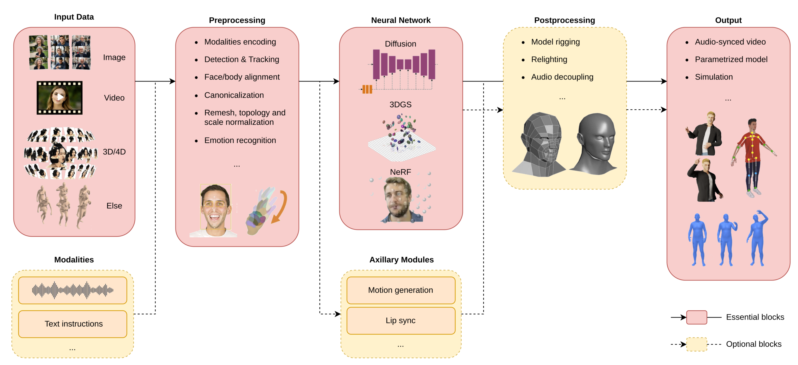
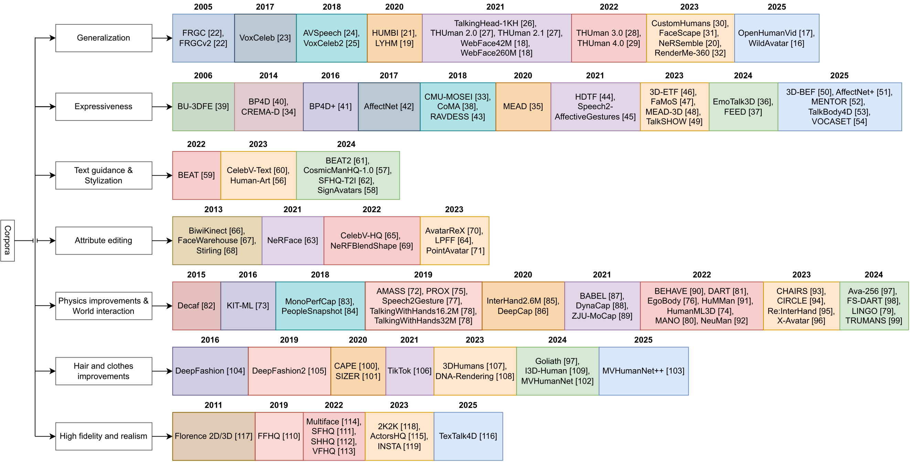
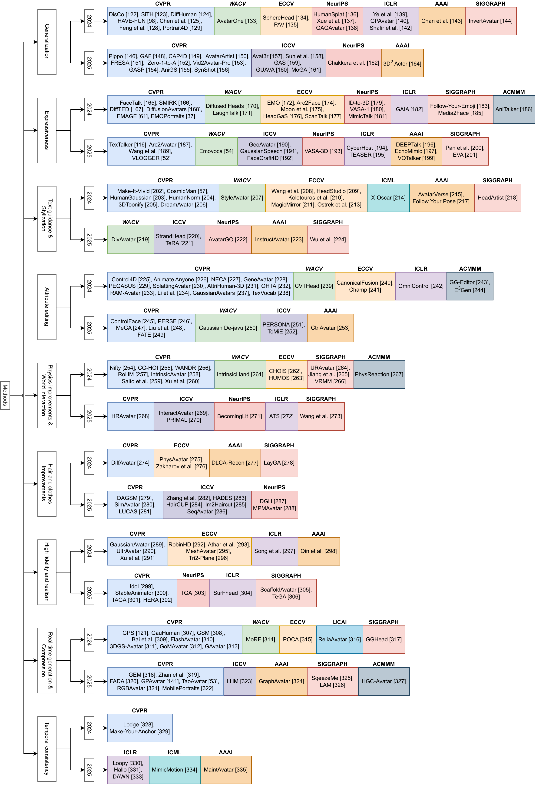

<div align="center">

# GenAI for Digital Avatar Synthesis — Review Resources

### A curated, browsable companion to the survey *“GenAI for Digital Avatar Synthesis: A Comprehensive Review.”*


[](LICENSE)

</div>

This repository is the supplementary material for our task-oriented review of **human-centric Generative AI for digital avatar synthesis**, covering work published in **2024–2025** at leading (CORE A / A\*) AI conferences. It collects, links, and organizes every generation **method** reviewed in the paper so the literature is easy to browse, cite, and extend.

> Diffusion models increasingly act as strong priors for synthesis and editing, while Gaussian-splatting representations dominate real-time reconstruction and rendering — pointing toward hybrid pipelines that jointly optimize controllability and deployability.

<div align="center">
  
  <br><em>An end-to-end avatar-synthesis pipeline: inputs and modalities → preprocessing → neural network (GAN / diffusion / NeRF / 3DGS) and auxiliary modules → postprocessing → deployable outputs.</em>
</div>

## Contents

- [Scope & taxonomy](#scope--taxonomy)
- [Corpora](#corpora)
- [Methods](#methods)
- [Citation & license](#citation--license)

## Scope & taxonomy

This companion accompanies a **task-oriented review of human-centric Generative AI for digital avatar synthesis**, concentrating on work published in **2024–2025** at leading (CORE A / A\*) AI conferences. Recent progress spans diverse output representations (images, video, 3D/4D assets) and conditioning signals (pose, speech, language instructions, affective attributes), broadening avatar applications to telepresence, virtual production, immersive AR / VR, and customer-facing interaction. The literature, however, is rapidly expanding and fragmented across problem settings, architectures, and deployment constraints.

To consolidate it, the review introduces a **unified taxonomy of nine task families**, aligns each task with both its representative methods and the corpora they use, and connects them through an end-to-end pipeline that links inputs and preprocessing to model components and deployable outputs (see the graphical abstract above). Across the field, diffusion models increasingly act as strong priors for synthesis and editing, while Gaussian-splatting representations dominate real-time reconstruction and rendering — pointing toward hybrid pipelines that jointly optimize controllability and deployability. Each method and corpus is placed under its primary task, mirroring the paper:

1. **Generalization** — reconstruct or animate new identities from few, single, or unconstrained in-the-wild observations, ideally without per-subject optimization.
2. **Expressiveness** — speech-, emotion-, and motion-driven faces and bodies with nuanced, fine-grained expressions and co-speech gestures.
3. **Text guidance & Stylization** — language-conditioned avatar generation, stylization, and editing from natural-language prompts.
4. **Attribute editing** — controllable, disentangled editing of appearance and shape, down to individual attributes such as hair, clothing, or expression.
5. **Physics improvements & World interaction** — relighting, contact, cloth and body dynamics, and human–object or human–scene interaction.
6. **Hair and clothes improvements** — strand-level hair, layered garments, and disentangled, simulation-ready assets.
7. **High fidelity and realism** — photorealistic geometry, texture, and appearance, often at high resolution.
8. **Real-time generation & Compression** — efficient, lightweight, on-device and streamable avatars.
9. **Temporal consistency** — long-horizon, drift-free, identity-stable video and motion.

<!-- CORPORA:START -->

## Corpora

**108** corpora used across the reviewed methods, grouped by the task they primarily serve (mirroring the paper). *Real-time generation & Compression* and *Temporal consistency* are architecture-level tasks and have no dedicated corpora. **Click a title to expand its type, modalities, and size.**

<div align="center">
  
  <br><em>The 108 reviewed corpora, grouped by primary task and publication year.</em>
</div>

### Generalization <sub>Corpora</sub>

<div align="center">

| Corpus | Title & Repository / Information | Venue |
|--------|-------------------------------|-------|
| **[FRGC](https://doi.org/10.1109/CVPR.2005.268)** | <details><summary>Overview of the Face Recognition Grand Challenge</summary><ul><li>Image corpus</li><li>Size: 5k+ images</li><li>Add. tasks: High fidelity and realism</li></ul></details> | CVPR 2005 |
| **[FRGCv2](https://doi.org/10.1109/CVPR.2005.268)** | <details><summary>Overview of the Face Recognition Grand Challenge</summary><ul><li>Image corpus</li><li>Size: 50k images</li><li>Add. tasks: High fidelity and realism</li></ul></details> | CVPR 2005 |
| **[VoxCeleb](https://doi.org/10.21437/Interspeech.2017-950)** | <details><summary>VoxCeleb: A Large-Scale Speaker Identification Dataset</summary><ul><li>Video corpus</li><li>Modalities: audio</li><li>Size: 153k+ clips</li><li>Add. tasks: Expressiveness</li></ul></details> | INTERSPEECH 2017 |
| **[AVSpeech](https://doi.org/10.1145/3197517.3201357)** | <details><summary>Looking to Listen at the Cocktail Party: A Speaker-Independent Audio-Visual Model for Speech Separation</summary><ul><li>Video corpus</li><li>Modalities: audio</li><li>Size: 4,700 hours</li><li>Add. tasks: Expressiveness</li></ul></details> | arXiv 2018 |
| **[VoxCeleb2](https://doi.org/10.21437/Interspeech.2018-1929)** | <details><summary>VoxCeleb2: Deep Speaker Recognition</summary><ul><li>Video corpus</li><li>Modalities: audio</li><li>Size: 1.09M clips</li><li>Add. tasks: Expressiveness</li></ul></details> | INTERSPEECH 2018 |
| **[HUMBI](https://doi.org/10.1109/CVPR42600.2020.00306)** | <details><summary>HUMBI: A Large Multiview Dataset of Human Body Expressions</summary><ul><li>3D/4D corpus</li><li>Modalities: motions</li><li>Size: 772 subjects</li><li>Add. tasks: High fidelity and realism</li></ul></details> | CVPR 2020 |
| **[LYHM](https://doi.org/10.1007/s11263-019-01260-7)** | <details><summary>Statistical Modeling of Craniofacial Shape and Texture</summary><ul><li>3D/4D corpus</li><li>Size: 1,216 subjects</li><li>Add. tasks: High fidelity and realism</li></ul></details> | IJCV 2020 |
| **[TalkingHead-1KH](https://doi.org/10.1109/CVPR46437.2021.00991)** | <details><summary>One-Shot Free-View Neural Talking-Head Synthesis for Video Conferencing</summary><ul><li>Video corpus</li><li>Modalities: audio</li><li>Size: 500k clips</li><li>Add. tasks: High fidelity and realism</li></ul></details> | CVPR 2021 |
| **[THUman2.0](https://doi.org/10.1109/CVPR46437.2021.00569)** | <details><summary>Function4d: Real-Time Human Volumetric Capture from Very Sparse Consumer RGBD Sensors</summary><ul><li>3D/4D corpus</li><li>Size: 500 scans</li><li>Add. tasks: Physics improvements & World interaction, High fidelity and realism</li></ul></details> | CVPR 2021 |
| **[THUman2.1](https://doi.org/10.1109/CVPR46437.2021.00569)** | <details><summary>Function4d: Real-Time Human Volumetric Capture from Very Sparse Consumer RGBD Sensors</summary><ul><li>3D/4D corpus</li><li>Size: 2,500 scans</li><li>Add. tasks: Physics improvements & World interaction, High fidelity and realism</li></ul></details> | CVPR 2021 |
| **[WebFace42M](https://doi.org/10.1109/CVPR46437.2021.01035)** | <details><summary>Webface260m: A Benchmark Unveiling the Power of Million-Scale Deep Face Recognition</summary><ul><li>Image corpus</li><li>Size: 42M images</li><li>Add. tasks: High fidelity and realism</li></ul></details> | CVPR 2021 |
| **[WebFace260M](https://doi.org/10.1109/CVPR46437.2021.01035)** | <details><summary>WebFace260M: A Benchmark Unveiling the Power of Million-Scale Deep Face Recognition</summary><ul><li>Image corpus</li><li>Size: 260M images</li><li>Add. tasks: High fidelity and realism</li></ul></details> | CVPR 2021 |
| **[THUman3.0](https://doi.org/10.1109/TPAMI.2022.3168569)** | <details><summary>Deepcloth: Neural Garment Representation for Shape and Style Editing</summary><ul><li>3D/4D corpus</li><li>Add. tasks: High fidelity and realism</li></ul></details> | TPAMI 2022 |
| **[THUman4.0](https://doi.org/10.1109/CVPR52688.2022.01543)** | <details><summary>Structured Local Radiance Fields for Human Avatar Modeling</summary><ul><li>Video corpus</li><li>Modalities: motions</li><li>Size: 3 clips, 7500+ frames</li><li>Add. tasks: Physics improvements & World interaction, High fidelity and realism</li></ul></details> | CVPR 2022 |
| **[CustomHumans](https://doi.org/10.1109/CVPR52729.2023.02014)** | <details><summary>Learning Locally Editable Virtual Humans</summary><ul><li>3D/4D corpus</li><li>Size: 643 scans</li><li>Add. tasks: High fidelity and realism</li></ul></details> | CVPR 2023 |
| **[FaceScape](https://doi.org/10.1109/TPAMI.2023.3307338)** | <details><summary>FaceScape: 3D Facial Dataset and Benchmark for Single-View 3D Face Reconstruction</summary><ul><li>3D/4D corpus</li><li>Modalities: emotions</li><li>Size: 938 subjects, 18,760 scans</li><li>Add. tasks: Expressiveness, Attribute editing, High fidelity and realism</li></ul></details> | TPAMI 2023 |
| **[NeRSemble](https://doi.org/10.1145/3592455)** | <details><summary>NeRSemble: Multi-View Radiance Field Reconstruction of Human Heads</summary><ul><li>Video corpus</li><li>Modalities: audio, emotions, motions</li><li>Size: 222 subjects, 31.7M frames</li><li>Add. tasks: Expressiveness, Attribute editing, High fidelity and realism</li></ul></details> | TOG 2023 |
| **[RenderMe-360](https://scholar.google.com/scholar?q=%22RenderMe-360%3A+A+Large+Digital+Asset+Library+and+Benchmarks+Towards+High-Fidelity+Head+Avatars%22)** | <details><summary>RenderMe-360: A Large Digital Asset Library and Benchmarks Towards High-Fidelity Head Avatars</summary><ul><li>3D/4D corpus</li><li>Modalities: audio, emotions, text, motions, hair/clothes</li><li>Size: 500 subjects, 243M frames</li><li>Add. tasks: Expressiveness, Text guidance & Stylization, Attribute editing, Hair and clothes improvements, High fidelity and realism</li></ul></details> | NeurIPS 2023 |
| **[OpenHumanVid](https://doi.org/10.1109/CVPR52734.2025.00726)** | <details><summary>OpenHumanVid: A Large-Scale High-Quality Dataset for Enhancing Human-Centric Video Generation</summary><ul><li>Video corpus</li><li>Modalities: audio, text, motions</li><li>Size: 13.2M clips, 16.7k hours</li><li>Add. tasks: Text guidance & Stylization, Physics improvements & World interaction, High fidelity and realism</li></ul></details> | CVPR 2025 |
| **[WildAvatar](https://doi.org/10.1109/CVPR52734.2025.01488)** | <details><summary>WildAvatar: Learning In-the-Wild 3D Avatars from the Web</summary><ul><li>Video corpus</li><li>Size: 10k+ subjects</li><li>Add. tasks: High fidelity and realism</li></ul></details> | CVPR 2025 |

</div>

### Expressiveness <sub>Corpora</sub>

<div align="center">

| Corpus | Title & Repository / Information | Venue |
|--------|-------------------------------|-------|
| **[BU-3DFE](https://doi.org/10.1109/FGR.2006.6)** | <details><summary>A 3D Facial Expression Database for Facial Behavior Research</summary><ul><li>3D/4D corpus</li><li>Modalities: emotions</li><li>Size: 6 emotions</li><li>Add. tasks: High fidelity and realism</li></ul></details> | FGR 2006 |
| **[BP4D](https://doi.org/10.1016/j.imavis.2014.06.002)** | <details><summary>Bp4d-Spontaneous: A High-Resolution Spontaneous 3D Dynamic Facial Expression Database</summary><ul><li>3D/4D corpus</li><li>Modalities: emotions, motions</li><li>Size: 41 subjects</li><li>Add. tasks: Attribute editing, High fidelity and realism</li></ul></details> | Image and Vision Computi 2014 |
| **[CREMA-D](https://doi.org/10.1109/TAFFC.2014.2336244)** | <details><summary>CREMA-D: Crowd-Sourced Emotional Multimodal Actors Dataset</summary><ul><li>Video corpus</li><li>Modalities: audio, emotions</li><li>Size: 7,442 clips</li></ul></details> | TAC 2014 |
| **[BP4D+](https://doi.org/10.1109/CVPR.2016.374)** | <details><summary>Multimodal Spontaneous Emotion Corpus for Human Behavior Analysis</summary><ul><li>3D/4D corpus</li><li>Modalities: emotions, motions</li><li>Size: 140 subjects</li><li>Add. tasks: Attribute editing, High fidelity and realism</li></ul></details> | CVPR 2016 |
| **[AffectNet](https://doi.org/10.1109/TAFFC.2017.2740923)** | <details><summary>AffectNet: A Database for Facial Expression, Valence, and Arousal Computing in the Wild</summary><ul><li>Image corpus</li><li>Modalities: emotions</li><li>Size: ~1M images</li><li>Add. tasks: Generalization</li></ul></details> | TAC 2017 |
| **[CMU-MOSEI](https://doi.org/10.18653/v1/P18-1208)** | <details><summary>Multimodal Language Analysis in the Wild: Cmu-Mosei Dataset and Interpretable Dynamic Fusion Graph</summary><ul><li>Video corpus</li><li>Modalities: audio, emotions, text</li><li>Size: 23k+ clips</li><li>Add. tasks: Generalization</li></ul></details> | ACL 2018 |
| **[CoMA](https://doi.org/10.1007/978-3-030-01219-9_43)** | <details><summary>Generating 3D Faces Using Convolutional Mesh Autoencoders</summary><ul><li>3D/4D corpus</li><li>Modalities: emotions, motions</li><li>Size: 12 subjects</li><li>Add. tasks: Attribute editing, High fidelity and realism</li></ul></details> | ECCV 2018 |
| **[RAVDESS](https://doi.org/10.1371/journal.pone.0196391)** | <details><summary>The Ryerson Audio-Visual Database of Emotional Speech and Song (Ravdess): A Dynamic, Multimodal Set of Facial and Vocal Expressions in North American English</summary><ul><li>Video corpus</li><li>Modalities: audio, emotions</li><li>Size: 1,440 clips</li></ul></details> | PloS one 2018 |
| **[MEAD](https://doi.org/10.1007/978-3-030-58589-1_42)** | <details><summary>MEAD: A Large-Scale Audio-Visual Dataset for Emotional Talking-Face Generation</summary><ul><li>Video corpus</li><li>Modalities: audio, emotions</li><li>Size: 60 subjects</li></ul></details> | ECCV 2020 |
| **[HDTF](https://doi.org/10.1109/CVPR46437.2021.00366)** | <details><summary>Flow-Guided One-Shot Talking Face Generation with a High-Resolution Audio-Visual Dataset</summary><ul><li>Video corpus</li><li>Modalities: audio</li><li>Size: 300+ subjects</li><li>Add. tasks: Generalization, High fidelity and realism</li></ul></details> | CVPR 2021 |
| **[Speech2-AffectiveGestures](https://doi.org/10.1145/3474085.3475223)** | <details><summary>Speech2-AffectiveGestures: Synthesizing Co-Speech Gestures with Generative Adversarial Affective Expression Learning</summary><ul><li>Video corpus</li><li>Modalities: audio, text, motions</li><li>Size: 1,766 clips, 106.1 hours</li><li>Add. tasks: Text guidance & Stylization, Physics improvements & World interaction</li></ul></details> | ACMMM 2021 |
| **[3D-ETF](https://doi.org/10.1109/ICCV51070.2023.01891)** | <details><summary>Emotalk: Speech-Driven Emotional Disentanglement for 3D Face Animation</summary><ul><li>3D/4D corpus</li><li>Modalities: audio, emotions, motions</li><li>Add. tasks: Generalization, Attribute editing</li></ul></details> | ICCV 2023 |
| **[FaMoS](https://doi.org/10.1109/CVPR52729.2023.00081)** | <details><summary>Instant Multi-View Head Capture Through Learnable Registration</summary><ul><li>3D/4D corpus</li><li>Modalities: emotions, motions</li><li>Size: 95 subjects, 600k frames</li><li>Add. tasks: Attribute editing, High fidelity and realism</li></ul></details> | CVPR 2023 |
| **[MEAD-3D](https://doi.org/10.1109/ICCV51070.2023.01305)** | <details><summary>Speech4mesh: Speech-Assisted Monocular 3D Facial Reconstruction for Speech-Driven 3D Facial Animation</summary><ul><li>3D/4D corpus</li><li>Modalities: emotions, motions</li><li>Add. tasks: Attribute editing</li></ul></details> | ICCV 2023 |
| **[TalkSHOW](https://doi.org/10.1109/CVPR52729.2023.00053)** | <details><summary>Generating Holistic 3D Human Motion from Speech</summary><ul><li>3D/4D corpus</li><li>Modalities: audio, emotions, motions</li><li>Size: 26.9 hours, 4 subjects</li><li>Add. tasks: Attribute editing, Physics improvements & World interaction</li></ul></details> | CVPR 2023 |
| **[EmoTalk3D](https://doi.org/10.1007/978-3-031-72998-0_4)** | <details><summary>EmoTalk3D: High-Fidelity Free-View Synthesis of Emotional 3D Talking Head</summary><ul><li>3D/4D corpus</li><li>Modalities: audio, emotions, motions</li><li>Size: 35 subjects</li><li>Add. tasks: Attribute editing, High fidelity and realism</li></ul></details> | ECCV 2024 |
| **[FEED](https://doi.org/10.1109/CVPR52733.2024.00812)** | <details><summary>Emoportraits: Emotion-Enhanced Multimodal One-Shot Head Avatars</summary><ul><li>Video corpus</li><li>Modalities: audio, emotions</li><li>Add. tasks: High fidelity and realism</li></ul></details> | CVPR 2024 |
| **[3D-BEF](https://doi.org/10.48550/arXiv.2503.11028)** | <details><summary>Emodiffusion: Enhancing Emotional 3D Facial Animation with Latent Diffusion Models</summary><ul><li>3D/4D corpus</li><li>Modalities: audio, emotions, motions</li><li>Size: 2k+ sequences, 9 emotions</li><li>Add. tasks: Attribute editing, High fidelity and realism</li></ul></details> | arXiv 2025 |
| **[AffectNet+](https://doi.org/10.1109/TAFFC.2025.3634523)** | <details><summary>AffectNet+: A Database for Enhancing Facial Expression Recognition with Soft-Labels</summary><ul><li>Image corpus</li><li>Modalities: emotions</li><li>Size: ~1M images</li><li>Add. tasks: Generalization</li></ul></details> | TAC 2025 |
| **[MENTOR](https://doi.org/10.1109/CVPR52734.2025.01482)** | <details><summary>Vlogger: Multimodal Diffusion for Embodied Avatar Synthesis</summary><ul><li>Video corpus</li><li>Modalities: audio, emotions, motions</li><li>Size: 800k subjects</li><li>Add. tasks: Generalization</li></ul></details> | CVPR 2025 |
| **[TalkBody4D](https://doi.org/10.1109/CVPR52734.2025.01002)** | <details><summary>Taoavatar: Real-Time Lifelike Full-Body Talking Avatars for Augmented Reality via 3D Gaussian Splatting</summary><ul><li>Video corpus</li><li>Modalities: audio, motions</li><li>Size: 8 sequences, 59 cameras</li><li>Add. tasks: Physics improvements & World interaction, High fidelity and realism</li></ul></details> | CVPR 2025 |
| **[VOCASET](https://doi.org/10.1109/WACV61041.2025.00283)** | <details><summary>Emovoca: Speech-Driven Emotional 3D Talking Heads</summary><ul><li>3D/4D corpus</li><li>Modalities: audio, motions</li><li>Size: 12 subjects</li><li>Add. tasks: Attribute editing</li></ul></details> | WACV 2025 |

</div>

### Text guidance & Stylization <sub>Corpora</sub>

<div align="center">

| Corpus | Title & Repository / Information | Venue |
|--------|-------------------------------|-------|
| **[BEAT](https://doi.org/10.1007/978-3-031-20071-7_36)** | <details><summary>BEAT: A Large-Scale Semantic and Emotional Multi-Modal Dataset for Conversational Gestures Synthesis</summary><ul><li>3D/4D corpus</li><li>Modalities: audio, emotions, text, motions</li><li>Size: 76 hours, 30 subjects</li><li>Add. tasks: Generalization, Expressiveness, Physics improvements & World interaction</li></ul></details> | ECCV 2022 |
| **[CelebV-Text](https://doi.org/10.1109/CVPR52729.2023.01422)** | <details><summary>CelebV-Text: A Large-Scale Facial Text-Video Dataset</summary><ul><li>Video corpus</li><li>Modalities: emotions, text</li><li>Size: 70k clips</li><li>Add. tasks: Generalization, Expressiveness, High fidelity and realism</li></ul></details> | CVPR 2023 |
| **[Human-Art](https://doi.org/10.1109/CVPR52729.2023.00067)** | <details><summary>Human-Art: A Versatile Human-Centric Dataset Bridging Natural and Artificial Scenes</summary><ul><li>Image corpus</li><li>Modalities: text</li><li>Size: 50k images</li><li>Add. tasks: Generalization</li></ul></details> | CVPR 2023 |
| **[BEAT2](https://doi.org/10.1109/CVPR52733.2024.00115)** | <details><summary>Emage: Towards Unified Holistic Co-Speech Gesture Generation via Expressive Masked Audio Gesture Modeling</summary><ul><li>3D/4D corpus</li><li>Modalities: audio, emotions, text, motions</li><li>Size: 60 hours</li><li>Add. tasks: Generalization, Expressiveness, Physics improvements & World interaction</li></ul></details> | CVPR 2024 |
| **[CosmicManHQ-1.0](https://doi.org/10.1109/CVPR52733.2024.00664)** | <details><summary>Cosmicman: A Text-to-Image Foundation Model for Humans</summary><ul><li>Image corpus</li><li>Modalities: text, hair/clothes</li><li>Size: 5.46M images</li><li>Add. tasks: Generalization, Hair and clothes improvements</li></ul></details> | CVPR 2024 |
| **[SFHQ-T2I](https://doi.org/10.34740/kaggle/dsv/9548853)** | <details><summary>Synthetic Faces High Quality - Text 2 Image (Sfhq-T2i) Dataset</summary><ul><li>Image corpus</li><li>Modalities: text</li><li>Size: 122,726 images</li><li>Add. tasks: Generalization, High fidelity and realism</li></ul></details> | Dataset 2024 |
| **[SignAvatars](https://doi.org/10.1007/978-3-031-72652-1_1)** | <details><summary>SignAvatars: A Large-Scale 3D Sign Language Holistic Motion Dataset and Benchmark</summary><ul><li>3D/4D corpus</li><li>Modalities: text, motions</li><li>Size: 70k clips, 153 subjects</li><li>Add. tasks: Generalization, Physics improvements & World interaction</li></ul></details> | ECCV 2024 |

</div>

### Attribute editing <sub>Corpora</sub>

<div align="center">

| Corpus | Title & Repository / Information | Venue |
|--------|-------------------------------|-------|
| **[BiwiKinect](https://doi.org/10.1007/s11263-012-0549-0)** | <details><summary>Random Forests for Real Time 3D Face Analysis</summary><ul><li>Video corpus</li><li>Modalities: motions</li><li>Size: 15k images, 20 subjects</li><li>Add. tasks: Physics improvements & World interaction, High fidelity and realism</li></ul></details> | IJCV 2013 |
| **[FaceWarehouse](https://doi.org/10.1109/TVCG.2013.249)** | <details><summary>FaceWarehouse: A 3D Facial Expression Database for Visual Computing</summary><ul><li>3D/4D corpus</li><li>Modalities: emotions, motions</li><li>Size: 150 subjects</li><li>Add. tasks: Generalization, Expressiveness</li></ul></details> | TVCG 2013 |
| **[Stirling](https://pics.stir.ac.uk/ESRC/)** | <details><summary>Stirling Esrc 3D Face Database</summary><ul><li>3D/4D corpus</li><li>Modalities: emotions, motions</li><li>Size: 99 subjects</li><li>Add. tasks: Expressiveness</li></ul></details> | Dataset 2013 |
| **[NeRFace](https://doi.org/10.1109/CVPR46437.2021.00854)** | <details><summary>Dynamic Neural Radiance Fields for Monocular 4D Facial Avatar Reconstruction</summary><ul><li>Video corpus</li><li>Add. tasks: High fidelity and realism</li></ul></details> | CVPR 2021 |
| **[CelebV-HQ](https://doi.org/10.1007/978-3-031-20071-7_38)** | <details><summary>CelebV-HQ: A Large-Scale Video Facial Attributes Dataset</summary><ul><li>Video corpus</li><li>Modalities: emotions</li><li>Size: 35k+ clips</li><li>Add. tasks: Generalization, Expressiveness, High fidelity and realism</li></ul></details> | ECCV 2022 |
| **[NeRFBlendShape](https://doi.org/10.1145/3550454.3555501)** | <details><summary>Reconstructing Personalized Semantic Facial NeRF Models from Monocular Video</summary><ul><li>Video corpus</li><li>Modalities: motions</li><li>Size: 8 subjects</li><li>Add. tasks: High fidelity and realism</li></ul></details> | TOG 2022 |
| **[AvatarReX](https://doi.org/10.1145/3592101)** | <details><summary>AvatarReX: Real-Time Expressive Full-Body Avatars</summary><ul><li>Video corpus</li><li>Modalities: motions</li><li>Size: 4 sequences, 16 cameras</li><li>Add. tasks: Physics improvements & World interaction, High fidelity and realism</li></ul></details> | TOG 2023 |
| **[LPFF](https://doi.org/10.1109/ICCV51070.2023.01859)** | <details><summary>LPFF: A Portrait Dataset for Face Generators Across Large Poses</summary><ul><li>Image corpus</li><li>Size: 19,590 images</li><li>Add. tasks: High fidelity and realism</li></ul></details> | ICCV 2023 |
| **[PointAvatar](https://doi.org/10.1109/CVPR52729.2023.02017)** | <details><summary>PointAvatar: Deformable Point-Based Head Avatars from Videos</summary><ul><li>Video corpus</li><li>Modalities: motions</li><li>Size: 3 subjects</li><li>Add. tasks: High fidelity and realism</li></ul></details> | CVPR 2023 |

</div>

### Physics improvements & World interaction <sub>Corpora</sub>

<div align="center">

| Corpus | Title & Repository / Information | Venue |
|--------|-------------------------------|-------|
| **[Decaf](https://doi.org/10.1109/TAFFC.2015.2392932)** | <details><summary>Decaf: Meg-Based Multimodal Database for Decoding Affective Physiological Responses</summary><ul><li>Video corpus</li><li>Modalities: motions</li><li>Size: 8 subjects</li><li>Add. tasks: Attribute editing, High fidelity and realism</li></ul></details> | TAC 2015 |
| **[KIT-ML](https://doi.org/10.1089/big.2016.0028)** | <details><summary>The Kit Motion-Language Dataset</summary><ul><li>Else corpus</li><li>Modalities: text, motions</li><li>Size: 3,911 clips, 6,278 texts</li><li>Add. tasks: Generalization, Text guidance & Stylization</li></ul></details> | Big Data 2016 |
| **[MonoPerfCap](https://doi.org/10.1145/3181973)** | <details><summary>MonoPerfCap: Human Performance Capture from Monocular Video</summary><ul><li>Video corpus</li><li>Modalities: motions</li><li>Size: 120 clips</li><li>Add. tasks: High fidelity and realism</li></ul></details> | TOG 2018 |
| **[PeopleSnapshot](https://doi.org/10.1109/CVPR.2018.00875)** | <details><summary>Video Based Reconstruction of 3D People Models</summary><ul><li>Video corpus</li><li>Modalities: motions</li><li>Size: 11 subjects</li></ul></details> | CVPR 2018 |
| **[AMASS](https://doi.org/10.1109/ICCV.2019.00554)** | <details><summary>AMASS: Archive of Motion Capture as Surface Shapes</summary><ul><li>Else corpus</li><li>Modalities: motions</li><li>Size: 11,265 motions</li></ul></details> | ICCV 2019 |
| **[PROX](https://doi.org/10.1109/ICCV.2019.00237)** | <details><summary>Resolving 3D Human Pose Ambiguities with 3D Scene Constraints</summary><ul><li>Video corpus</li><li>Modalities: motions</li><li>Size: 12 scenes</li></ul></details> | ICCV 2019 |
| **[Speech2Gesture](https://doi.org/10.1109/CVPR.2019.00361)** | <details><summary>Learning Individual Styles of Conversational Gesture</summary><ul><li>Video corpus</li><li>Modalities: audio, motions</li><li>Size: 2,710 clips, 144 hours</li><li>Add. tasks: Generalization, Expressiveness</li></ul></details> | CVPR 2019 |
| **[Talking-WithHands16.2M](https://doi.org/10.1109/ICCV.2019.00085)** | <details><summary>Talking-WithHands16.2M: A Large-Scale Dataset of Synchronized Body-Finger Motion and Audio for Conversational Motion Analysis and Synthesis</summary><ul><li>3D/4D corpus</li><li>Modalities: audio, motions</li><li>Size: 16.2M frames</li><li>Add. tasks: Generalization, Expressiveness</li></ul></details> | ICCV 2019 |
| **[Talking-WithHands32M](https://doi.org/10.1109/ICCV.2019.00085)** | <details><summary>Talking with Hands 16.2 M: A Large-Scale Dataset of Synchronized Body-Finger Motion and Audio for Conversational Motion Analysis and Synthesis</summary><ul><li>3D/4D corpus</li><li>Modalities: audio, motions</li><li>Size: 32M frames</li><li>Add. tasks: Generalization, Expressiveness</li></ul></details> | ICCV 2019 |
| **[InterHand2.6M](https://doi.org/10.1007/978-3-030-58565-5_33)** | <details><summary>InterHand2.6M: A Dataset and Baseline for 3D Interacting Hand Pose Estimation from a Single RGB Image</summary><ul><li>Image corpus</li><li>Modalities: motions</li><li>Size: 26 subjects</li><li>Add. tasks: Attribute editing</li></ul></details> | ECCV 2020 |
| **[DeepCap](https://doi.org/10.1109/CVPR42600.2020.00510)** | <details><summary>DeepCap: Monocular Human Performance Capture Using Weak Supervision</summary><ul><li>Video corpus</li><li>Modalities: motions</li><li>Size: 17 sequences</li><li>Add. tasks: High fidelity and realism</li></ul></details> | CVPR 2020 |
| **[BABEL](https://doi.org/10.1109/CVPR46437.2021.00078)** | <details><summary>BABEL: Bodies, Action and Behavior with English Labels</summary><ul><li>Else corpus</li><li>Modalities: text, motions</li><li>Size: 43 hours, 250+ actions</li><li>Add. tasks: Generalization, Text guidance & Stylization</li></ul></details> | CVPR 2021 |
| **[DynaCap](https://doi.org/10.1145/3450626.3459749)** | <details><summary>Real-Time Deep Dynamic Characters</summary><ul><li>Video corpus</li><li>Modalities: motions</li><li>Size: 5 sequences</li></ul></details> | TOG 2021 |
| **[ZJU-MoCap](https://doi.org/10.1109/CVPR46437.2021.00894)** | <details><summary>Neural Body: Implicit Neural Representations with Structured Latent Codes for Novel View Synthesis of Dynamic Humans</summary><ul><li>Video corpus</li><li>Modalities: motions</li><li>Size: 9 sequences</li></ul></details> | CVPR 2021 |
| **[BEHAVE](https://doi.org/10.1109/CVPR52688.2022.01547)** | <details><summary>BEHAVE: Dataset and Method for Tracking Human Object Interactions</summary><ul><li>3D/4D corpus</li><li>Modalities: motions</li><li>Size: 321 sequences</li><li>Add. tasks: High fidelity and realism</li></ul></details> | CVPR 2022 |
| **[DART](https://scholar.google.com/scholar?q=%22DART%3A+Articulated+Hand+Model+with+Diverse+Accessories+and+Rich+Textures%22)** | <details><summary>DART: Articulated Hand Model with Diverse Accessories and Rich Textures</summary><ul><li>Image corpus</li><li>Modalities: motions</li><li>Size: 800k images</li><li>Add. tasks: High fidelity and realism</li></ul></details> | NeurIPS 2022 |
| **[EgoBody](https://doi.org/10.1007/978-3-031-20068-7_11)** | <details><summary>EgoBody: Human Body Shape and Motion of Interacting People from Head-Mounted Devices</summary><ul><li>Video corpus</li><li>Modalities: motions</li><li>Size: 125 sequences</li></ul></details> | ECCV 2022 |
| **[HuMMan](https://doi.org/10.1007/978-3-031-20071-7_33)** | <details><summary>HuMMan: Multi-Modal 4D Human Dataset for Versatile Sensing and Modeling</summary><ul><li>3D/4D corpus</li><li>Modalities: motions</li><li>Size: 1k subjects, 60M frames</li><li>Add. tasks: Generalization, High fidelity and realism</li></ul></details> | ECCV 2022 |
| **[HumanML3D](https://doi.org/10.1109/CVPR52688.2022.00509)** | <details><summary>Generating Diverse and Natural 3D Human Motions from Text</summary><ul><li>Else corpus</li><li>Modalities: text, motions</li><li>Size: 14.6k clips, 45.0k texts</li><li>Add. tasks: Generalization, Text guidance & Stylization</li></ul></details> | CVPR 2022 |
| **[MANO](https://doi.org/10.48550/arXiv.2201.02610)** | <details><summary>Embodied Hands: Modeling and Capturing Hands and Bodies Together</summary><ul><li>3D/4D corpus</li><li>Modalities: motions</li><li>Size: 1k+ scans</li><li>Add. tasks: Attribute editing</li></ul></details> | arXiv 2022 |
| **[NeuMan](https://doi.org/10.1007/978-3-031-19824-3_24)** | <details><summary>NeuMan: Neural Human Radiance Field from a Single Video</summary><ul><li>Video corpus</li><li>Size: 6 clips</li><li>Add. tasks: High fidelity and realism</li></ul></details> | ECCV 2022 |
| **[CHAIRS](https://doi.org/10.1109/ICCV51070.2023.00859)** | <details><summary>Full-Body Articulated Human-Object Interaction</summary><ul><li>3D/4D corpus</li><li>Modalities: motions</li><li>Size: 17.3 hours, 46 subjects</li><li>Add. tasks: Attribute editing, High fidelity and realism</li></ul></details> | ICCV 2023 |
| **[CIRCLE](https://doi.org/10.1109/CVPR52729.2023.02032)** | <details><summary>CIRCLE: Capture in Rich Contextual Environments</summary><ul><li>3D/4D corpus</li><li>Modalities: motions</li><li>Size: 10 hours</li></ul></details> | CVPR 2023 |
| **[Re:InterHand](https://scholar.google.com/scholar?q=%22A+Dataset+of+Relighted+3D+Interacting+Hands%22)** | <details><summary>A Dataset of Relighted 3D Interacting Hands</summary><ul><li>3D/4D corpus</li><li>Modalities: motions</li><li>Size: 106,766 scans</li><li>Add. tasks: Attribute editing, High fidelity and realism</li></ul></details> | NeurIPS 2023 |
| **[X-Avatar](https://doi.org/10.1109/CVPR52729.2023.01622)** | <details><summary>X-Avatar: Expressive Human Avatars</summary><ul><li>3D/4D corpus</li><li>Modalities: motions</li><li>Size: 233 sequences</li><li>Add. tasks: Attribute editing, High fidelity and realism</li></ul></details> | CVPR 2023 |
| **[Ava-256](https://doi.org/10.52202/079017-2640)** | <details><summary>Codec Avatar Studio: Paired Human Captures for Complete, Driveable, and Generalizable Avatars</summary><ul><li>3D/4D corpus</li><li>Modalities: motions</li><li>Size: 256 subjects</li><li>Add. tasks: Attribute editing, High fidelity and realism</li></ul></details> | NeurIPS 2024 |
| **[FS-DART](https://doi.org/10.1109/CVPR52733.2024.00077)** | <details><summary>Have-Fun: Human Avatar Reconstruction from Few-Shot Unconstrained Images</summary><ul><li>3D/4D corpus</li><li>Modalities: motions</li><li>Size: 100 subjects</li><li>Add. tasks: High fidelity and realism</li></ul></details> | CVPR 2024 |
| **[LINGO](https://doi.org/10.1145/3680528.3687595)** | <details><summary>Autonomous Character-Scene Interaction Synthesis from Text Instruction</summary><ul><li>Else corpus</li><li>Modalities: text, motions</li><li>Size: 16 hours</li><li>Add. tasks: Text guidance & Stylization</li></ul></details> | SIGGRAPH 2024 |
| **[TRUMANS](https://doi.org/10.1109/CVPR52733.2024.00171)** | <details><summary>Scaling up Dynamic Human-Scene Interaction Modeling</summary><ul><li>3D/4D corpus</li><li>Modalities: motions</li><li>Size: 15 hours</li><li>Add. tasks: High fidelity and realism</li></ul></details> | CVPR 2024 |

</div>

### Hair and clothes improvements <sub>Corpora</sub>

<div align="center">

| Corpus | Title & Repository / Information | Venue |
|--------|-------------------------------|-------|
| **[DeepFashion](https://doi.org/10.1109/CVPR.2016.124)** | <details><summary>DeepFashion: Powering Robust Clothes Recognition and Retrieval with Rich Annotations</summary><ul><li>Image corpus</li><li>Modalities: hair/clothes</li><li>Size: 801k items</li><li>Add. tasks: High fidelity and realism</li></ul></details> | CVPR 2016 |
| **[DeepFashion2](https://doi.org/10.1109/CVPR.2019.00548)** | <details><summary>DeepFashion2: A Versatile Benchmark for Detection, Pose Estimation, Segmentation and Re-Identification of Clothing Images</summary><ul><li>Image corpus</li><li>Modalities: hair/clothes</li><li>Size: 801k items</li><li>Add. tasks: High fidelity and realism</li></ul></details> | CVPR 2019 |
| **[CAPE](https://doi.org/10.1109/CVPR42600.2020.00650)** | <details><summary>Learning to Dress 3D People in Generative Clothing</summary><ul><li>3D/4D corpus</li><li>Modalities: hair/clothes</li><li>Size: 150k scans, 15 subjects</li><li>Add. tasks: Physics improvements & World interaction</li></ul></details> | CVPR 2020 |
| **[SIZER](https://doi.org/10.1007/978-3-030-58580-8_1)** | <details><summary>SIZER: A Dataset and Model for Parsing 3D Clothing and Learning Size Sensitive 3D Clothing</summary><ul><li>3D/4D corpus</li><li>Modalities: hair/clothes</li><li>Size: 2k scans</li></ul></details> | ECCV 2020 |
| **[TikTok](https://doi.org/10.1109/CVPR46437.2021.01256)** | <details><summary>Learning High Fidelity Depths of Dressed Humans by Watching Social Media Dance Videos</summary><ul><li>3D/4D corpus</li><li>Size: 300+ sequences, 100k+ frames</li><li>Add. tasks: Generalization, High fidelity and realism</li></ul></details> | CVPR 2021 |
| **[3DHumans](https://doi.org/10.1007/s11263-022-01736-z)** | <details><summary>Sharp: Shape-Aware Reconstruction of People in Loose Clothing</summary><ul><li>3D/4D corpus</li><li>Modalities: motions, hair/clothes</li><li>Size: ~180 scans</li><li>Add. tasks: Attribute editing, High fidelity and realism</li></ul></details> | IJCV 2023 |
| **[DNA-Rendering](https://doi.org/10.1109/ICCV51070.2023.01829)** | <details><summary>DNA-Rendering: A Diverse Neural Actor Repository for High-Fidelity Human-Centric Rendering</summary><ul><li>Video corpus</li><li>Modalities: motions, hair/clothes</li><li>Size: 1,500+ subjects, 67.5M frames</li><li>Add. tasks: Generalization, Physics improvements & World interaction, High fidelity and realism</li></ul></details> | ICCV 2023 |
| **[Goliath](https://doi.org/10.52202/079017-2640)** | <details><summary>Codec Avatar Studio: Paired Human Captures for Complete, Driveable, and Generalizable Avatars</summary><ul><li>3D/4D corpus</li><li>Modalities: motions, hair/clothes</li><li>Size: 4 subjects</li><li>Add. tasks: Physics improvements & World interaction, High fidelity and realism</li></ul></details> | NeurIPS 2024 |
| **[I3D-Human](https://doi.org/10.1007/978-3-031-72967-6_27)** | <details><summary>Within the Dynamic Context: Inertia-Aware 3D Human Modeling with Pose Sequence</summary><ul><li>3D/4D corpus</li><li>Modalities: motions, hair/clothes</li><li>Size: 6 subjects, 10k frames</li><li>Add. tasks: Physics improvements & World interaction</li></ul></details> | ECCV 2024 |
| **[MVHumanNet](https://doi.org/10.1109/CVPR52733.2024.01872)** | <details><summary>MVHumanNet: A Large-Scale Dataset of Multi-View Daily Dressing Human Captures</summary><ul><li>Video corpus</li><li>Modalities: text, motions</li><li>Size: 4,500 subjects, 645M frames</li><li>Add. tasks: Generalization, Text guidance & Stylization, Physics improvements & World interaction, High fidelity and realism</li></ul></details> | CVPR 2024 |
| **[MVHumanNet++](https://doi.org/10.48550/arXiv.2505.01838)** | <details><summary>MVHumanNet++: A Large-Scale Dataset of Multi-View Daily Dressing Human Captures with Richer Annotations for 3D Human Digitization</summary><ul><li>Video corpus</li><li>Modalities: text, motions</li><li>Size: 4,500 subjects, 645M frames</li><li>Add. tasks: Generalization, Text guidance & Stylization, Physics improvements & World interaction, High fidelity and realism</li></ul></details> | arXiv 2025 |

</div>

### High fidelity and realism <sub>Corpora</sub>

<div align="center">

| Corpus | Title & Repository / Information | Venue |
|--------|-------------------------------|-------|
| **[Florence2D/3D](https://doi.org/10.1145/2072572.2072597)** | <details><summary>The Florence 2D/3D Hybrid Face Dataset</summary><ul><li>3D/4D corpus</li><li>Modalities: emotions</li></ul></details> | J-HGBU 2011 |
| **[FFHQ](https://doi.org/10.1109/CVPR.2019.00453)** | <details><summary>A Style-Based Generator Architecture for Generative Adversarial Networks</summary><ul><li>Image corpus</li><li>Size: 70k images</li><li>Add. tasks: Generalization</li></ul></details> | CVPR 2019 |
| **[Multiface](https://doi.org/10.48550/arXiv.2207.11243)** | <details><summary>Multiface: A Dataset for Neural Face Rendering</summary><ul><li>Video corpus</li><li>Modalities: motions</li><li>Size: 13 subjects</li></ul></details> | arXiv 2022 |
| **[SFHQ](https://doi.org/10.34740/kaggle/dsv/4737549)** | <details><summary>Synthetic Faces High Quality (Sfhq) Dataset</summary><ul><li>Image corpus</li><li>Size: 100k images</li><li>Add. tasks: Generalization</li></ul></details> | Dataset 2022 |
| **[SHHQ](https://doi.org/10.1007/978-3-031-19787-1_1)** | <details><summary>StyleGAN-Human: A Data-Centric Odyssey of Human Generation</summary><ul><li>Image corpus</li><li>Size: 40k images</li><li>Add. tasks: Generalization</li></ul></details> | ECCV 2022 |
| **[VFHQ](https://doi.org/10.1109/CVPRW56347.2022.00081)** | <details><summary>VFHQ: A High-Quality Dataset and Benchmark for Video Face Super-Resolution</summary><ul><li>Video corpus</li><li>Size: 16k+ clips</li><li>Add. tasks: Generalization</li></ul></details> | CVPR 2022 |
| **[2K2K](https://doi.org/10.1109/CVPR52729.2023.01237)** | <details><summary>High-Fidelity 3D Human Digitization from Single 2K Resolution Images</summary><ul><li>3D/4D corpus</li><li>Modalities: motions</li><li>Size: 2k images</li></ul></details> | CVPR 2023 |
| **[ActorsHQ](https://doi.org/10.1145/3592415)** | <details><summary>Humanrf: High-Fidelity Neural Radiance Fields for Humans in Motion</summary><ul><li>Video corpus</li><li>Size: 39,765 frames, 160 cameras</li><li>Add. tasks: Physics improvements & World interaction</li></ul></details> | TOG 2023 |
| **[INSTA](https://doi.org/10.1109/CVPR52729.2023.00444)** | <details><summary>Instant Volumetric Head Avatars</summary><ul><li>Video corpus</li><li>Modalities: motions</li><li>Add. tasks: Attribute editing</li></ul></details> | CVPR 2023 |
| **[TexTalk4D](https://doi.org/10.1109/CVPR52734.2025.00028)** | <details><summary>Towards High-Fidelity 3D Talking Avatar with Personalized Dynamic Texture</summary><ul><li>3D/4D corpus</li><li>Modalities: audio, motions</li><li>Size: 100 subjects, 100 minutes</li><li>Add. tasks: Generalization, Expressiveness, Attribute editing</li></ul></details> | CVPR 2025 |

</div>

<!-- CORPORA:END -->

<!-- METHODS:START -->

## Methods

**203** primary methods reviewed across **9** task families, plus **6** logical continuation papers (**209** works in total). Every entry is an avatar-generation method published at a 2024–2025 CORE A/A\* venue. Rows marked `↳` are follow-up papers grouped under the method they extend. **Click a title to expand a one-line summary.**

<div align="center">
  
  <br><em>The 203 reviewed methods, grouped by primary task and publication year.</em>
</div>

### Generalization <sub>Methods</sub>

<div align="center">

| Method | Title & Repository / Description | Venue |
|--------|-------------------------------|-------|
| **[DisCo](https://doi.org/10.1109/CVPR52733.2024.00891)** | <details><summary><a href="https://github.com/Wangt-CN/DisCo">DisCo: Disentangled Control for Realistic Human Dance Generation</a> (Apache 2.0)</summary><br>DisCo introduces a pose-guided synthesis model for realistic human dance generation that emphasizes two principles: generalizability and compositionality. To achieve this, the authors design a disentangled-control architecture with a human-attribute pretraining stage.</details> | CVPR 2024 |
| **[SiTH](https://doi.org/10.1109/CVPR52733.2024.00058)** | <details><summary>SiTH: Single-View Textured Human Reconstruction with Image-Conditioned Diffusion</summary><br>SiTH proposes a two-stage pipeline that reconstructs a fully textured 3D human mesh from a single input image. First, an image-conditioned diffusion model hallucinates the back-view appearance of the person. Then, a mesh reconstruction network uses both the original front view and the hallucinated back view, guided by a skinned human body prior, to reconstruct full-body geometry and texture.</details> | CVPR 2024 |
| **[DiffHuman](https://doi.org/10.1109/CVPR52733.2024.00143)** | <details><summary>DiffHuman: Probabilistic Photorealistic 3D Reconstruction of Humans</summary><br>DiffHuman is a conditional diffusion model that denoises pixel-aligned 2D observations of an underlying 3D shape representation. The authors propose a novel neural generator that approximates rendering with reduced runtime (up to ×55).</details> | CVPR 2024 |
| **[HaveFun](https://doi.org/10.1109/CVPR52733.2024.00077)** | <details><summary>HaveFun: Human Avatar Reconstruction from Few-Shot Unconstrained Images</summary><br>The authors of HaveFun present a framework that can reconstruct animatable full‑body human avatars from a small set of unconstrained images by combining a skinning mechanism with Deep Marching Tetrahedra and a two‑phase optimization: reference alignment and unseen‑region guidance.</details> | CVPR 2024 |
| **[Morphable Diffusion](https://doi.org/10.1109/CVPR52733.2024.00986)** | <details><summary>Morphable Diffusion: 3D-Consistent Diffusion for Single-Image Avatar Creation</summary><br>The authors introduce a diffusion model that enables creation of fully 3D animatable photorealistic human avatars. They have managed to integrate 3D morphable multi-view-consistent model (e.g., SMPL or FLAME) into a denoising approach with seamless and accurate incorporation of facial expressions and body pose control into the generation process.</details> | CVPR 2024 |
| **[Stratified Avatar](https://doi.org/10.1109/CVPR52733.2024.00023)** | <details><summary>Stratified Avatar Generation from Sparse Observations</summary><br>The paper proposes a stratified two-stage pipeline that first reconstructs an upper-body avatar from a small set of sparse HMD and hand observations and then conditions a lower-body synthesis on the learned upper-body latent to recover full-body poses. The authors leverage a VQ-VAE and latent diffusion formulation to model the conditional distribution of full-body motion given sparse inputs.</details> | CVPR 2024 |
| **[Portrait4D](https://doi.org/10.1109/CVPR52733.2024.00680)** | <details><summary>Portrait4D: Learning One-Shot 4D Head Avatar Synthesis Using Synthetic Data</summary><br>Portrait4D proposes a one-shot framework for 4D head avatar synthesis from a single image. It first implies training a part-wise 4D generative model to synthesize multi-view and motion-varying training data and then using a transformer-based animatable tri-plane reconstructor for avatar reconstruction. Similar to, they first train a 3D head synthesizer on synthetic multi-view images, use it to convert monocular real videos into pseudo multi-view ones and then learn a full 4D head synthesizer via cross-view self-reenactment.</details> | CVPR 2024 |
| [Portrait4D-v2](https://doi.org/10.1007/978-3-031-72643-9_19) <sup>cont. of Portrait4D</sup> | <details><summary>Portrait4D-V2: Pseudo Multi-View Data Creates Better 4D Head Synthesizer</summary><br>In their next work, the authors introduce Portrait4D-v2, a feedforward one-shot 4D head avatar synthesis method that replaces reliance on monocular-video reconstruction and 3DMM guidance with pseudo multi-view data.</details> | ECCV 2024 |
| **[AvatarOne](https://doi.org/10.1109/WACV57701.2024.00361)** | <details><summary>AvatarOne: Monocular 3D Human Animation</summary><br>AvatarOne reconstructs an animatable 3D human avatar from a single monocular video and a tracked skeleton. The method builds a canonical SDF representation with accompanying texture, then uses a forward-skinning deformation module and grid-based volumetric rendering to support novel-pose and novel-view synthesis.</details> | WACV 2024 |
| **[SphereHead](https://doi.org/10.1007/978-3-031-73226-3_19)** | <details><summary>SphereHead: Stable 3D Full-Head Synthesis with Spherical Tri-Plane Representation</summary><br>SphereHead introduces a spherical tri‑plane representation for 3D head synthesis, which better models full-head geometry and reduces back-view artifacts compared to standard Cartesian tri-planes. Another proposition is a view-image consistency loss that enforces alignment between generated images and camera parameters, enabling stable 360-degree head generation and inversion from a single image.</details> | ECCV 2024 |
| **[PAV](https://doi.org/10.1007/978-3-031-72940-9_7)** | <details><summary>PAV: Personalized Head Avatar from Unstructured Video Collection</summary><br>PAV proposes learning a dynamic deformable NeRF from a collection of monocular videos of the same person under different appearances (e.g., hair, facial changes). The method attaches learnable latent appearance embeddings to a base mesh and conditions both density and color of the NeRF on them.</details> | ECCV 2024 |
| **[HumanSplat](https://doi.org/10.52202/079017-2367)** | <details><summary>HumanSplat: Generalizable Single-Image Human Gaussian Splatting with Structure Priors</summary><br>In HumanSplat, the authors propose a method to reconstruct a 3D human avatar from a single image by predicting 3DGS parameters using a 2D multi‑view diffusion model and a latent reconstruction transformer, enriched with human-structure priors. This allows feedforward generation of human Gaussians without per-subject optimization or dense multi-view capture.</details> | NeurIPS 2024 |
| **[Human-3Diffusion](https://doi.org/10.52202/079017-3160)** | <details><summary>Human-3Diffusion: Realistic Avatar Creation via Explicit 3D Consistent Diffusion Models</summary><br>The authors propose a realistic avatar creation pipeline. Similar to previous approaches, it first utilizes a 2D multi-view diffusion model as a prior. Then it uses an image-conditioned 3DGS reconstruction model for explicit 3D representation.</details> | NeurIPS 2024 |
| **[GAGAvatar](https://scholar.google.com/scholar?q=%22Generalizable+and+Animatable+Gaussian+Head+Avatar%22)** | <details><summary>Generalizable and Animatable Gaussian Head Avatar</summary><br>The authors propose GAGAvatar, a one-shot animatable head avatar method that regresses 3D Gaussian parameters from a single image using a dual-lifting approach and integrates 3DMM priors for expression control. The feedforward model reconstructs unseen identities without per-subject optimization and renders reenactments in real time.</details> | NeurIPS 2024 |
| **[Real3D-Portrait](https://scholar.google.com/scholar?q=%22Real3D-Portrait%3A+One-Shot+Realistic+3D+Talking+Portrait+Synthesis%22)** | <details><summary>Real3D-Portrait: One-Shot Realistic 3D Talking Portrait Synthesis</summary><br>Real3D-Portrait presents a one-shot pipeline that reconstructs a 3D avatar from a single image and conditions it on audio or video to produce talking head avatars. The system uses a large image-to-plane 3D prior, an efficient motion adapter for conditioned animation, and a head-torso/background super-resolution model.</details> | ICLR 2024 |
| **[GPAvatar (multi-input)](https://scholar.google.com/scholar?q=%22GPAvatar%3A+Generalizable+and+Precise+Head+Avatar+from+Image%28s%29%22)** | <details><summary>GPAvatar: Generalizable and Precise Head Avatar from Image(s)</summary><br>In the work GPAvatar (not to be confused with), a method is proposed that reconstructs a 3D head avatar from one or several input images in a single forward pass by using a dynamic point‑based expression field and a Multi Tri-planes Attention fusion module to combine information from multiple images.</details> | ICLR 2024 |
| **[Shafir et al.](https://scholar.google.com/scholar?q=%22Human+Motion+Diffusion+as+a+Generative+Prior%22)** | <details><summary>Human Motion Diffusion as a Generative Prior</summary><br>The paper also proposes using a pretrained motion diffusion model as a generative prior to overcome data scarcity in motion synthesis. The authors introduce three composition mechanisms -- sequential, parallel, and model composition -- enabling long animations, two-person motion, and fine‑grained control without collecting huge new corpora. For example, with their “DoubleTake” inference trick, they generate long motion sequences from a prior trained only on short clips.</details> | ICLR 2024 |
| **[Fine Structure-Aware Sampling](https://doi.org/10.1609/aaai.v38i2.27856)** | <details><summary>Fine Structure-Aware Sampling: A New Sampling Training Scheme for Pixel-Aligned Implicit Models in Single-View Human Reconstruction</summary><br>The paper proposes a Fine Structure-Aware Sampling strategy that emphasizes “fine” structures (ears, fingers, hair edges) when training pixel-aligned implicit models from single views, reducing reconstruction artifacts and improving detailed geometry/texture recovery.</details> | AAAI 2024 |
| **[InvertAvatar](https://doi.org/10.1145/3641519.3657478)** | <details><summary>InvertAvatar: Incremental GAN Inversion for Generalized Head Avatars</summary><br>The authors introduce InvertAvatar, an incremental 3D GAN inversion method that improves avatar reconstruction quality as more frames are provided. The technique includes an animatable 3D-GAN prior, a neural texture encoder with UV parameterization, and temporal aggregation (ConvGRU) to boost geometry/texture detail from multi-frame input.</details> | SIGGRAPH 2024 |
| **[Pippo](https://doi.org/10.1109/CVPR52734.2025.01531)** | <details><summary>Pippo: High-Resolution Multi-View Humans from a Single Image</summary><br>Pippo is a generative model based on a multi-view DiT designed to create dense, 1K resolution turnaround videos or multi-view 3D representations of a person from a single input image. It uses a multi-stage training approach, starting with pretraining on 3B human images. Key innovations include an attention biasing technique that allows generating more views than in the original training distribution and a ControlMLP that uses pixel-aligned controls to enhance 3D consistency during high-resolution generation.</details> | CVPR 2025 |
| **[GAF](https://doi.org/10.1109/CVPR52734.2025.00521)** | <details><summary>GAF: Gaussian Avatar Reconstruction from Monocular Videos via Multi-View Diffusion</summary><br>In GAF, the authors propose reconstructing animatable 3DGS head avatars from a monocular video captured on a commodity device. They use a multi-view latent diffusion model conditioned on normal maps from a FLAME model mesh and VAE image features to generate pseudo-ground-truth novel-view renderings, which guide the optimization of a 3DGS avatar representation. A latent upsampler further refines facial detail before decoding.</details> | CVPR 2025 |
| **[CAP4D](https://doi.org/10.1109/CVPR52734.2025.00501)** | <details><summary>CAP4D: Creating Animatable 4D Portrait Avatars with Morphable Multi-View Diffusion Models</summary><br>CAP4D uses a morphable multi-view diffusion model to reconstruct 4D avatars. It works with an arbitrary number of reference images, even with just one. The proposed pipeline is capable of predicting novel views and unseen expressions.</details> | CVPR 2025 |
| **[AvatarArtist](https://doi.org/10.1109/CVPR52734.2025.01005)** | <details><summary>AvatarArtist: Open-Domain 4D Avatarization</summary><br>In AvatarArtist, the authors propose a training paradigm using both GANs and diffusion models. They explain that, based on their observations, 4D-GANs fail at cross-domain tasks, but excel at bridging images and tri-planes. 2D diffusion models in the pipeline serve as diverse data distribution experts that assist GANs in the avatar creation.</details> | CVPR 2025 |
| **[FRESA](https://doi.org/10.1109/CVPR52734.2025.00035)** | <details><summary>FRESA: Feedforward Reconstruction of Personalized Skinned Avatars from Few Images</summary><br>FRESA reconstructs personalized full-body skinned avatars from just a few casual images in a single feedforward pass. The method jointly infers shape, skinning weights, and pose-dependent deformations, improving geometric fidelity over shared-weight approaches. Multi-frame feature aggregation and 3D canonicalization help capture details.</details> | CVPR 2025 |
| **[Zero-1-to-A](https://doi.org/10.1109/CVPR52734.2025.01486)** | <details><summary>Zero-1-to-A: Zero-Shot One Image to Animatable Head Avatars Using Video Diffusion</summary><br>Zero-1-to-A is a method of synthesizing spatially and temporally consistent corpora for 4D digital avatar synthesis. It iteratively constructs video subsets, progressively trains a diffusion model in such a way that the resulting quality is improved and the animation is more temporally coherent.</details> | CVPR 2025 |
| **[Vid2Avatar-Pro](https://doi.org/10.1109/CVPR52734.2025.00522)** | <details><summary>Vid2Avatar-Pro: Authentic Avatar from Videos in the Wild via Universal Prior</summary><br>Sharing a common idea about efficient priors, Vid2Avatar-Pro uses a universal prior model trained on multiple clothed human views to guide the fitting of a photorealistic avatar from a monocular in-the-wild video. The avatar is represented via expressive 3D Gaussians with shared canonical front/back maps. Inverse rendering is used to adapt the prior to the input identity.</details> | CVPR 2025 |
| **[GASP](https://doi.org/10.1109/CVPR52734.2025.00034)** | <details><summary>GASP: Gaussian Avatars with Synthetic Priors</summary><br>The authors train a 3DGS model prior using a perfectly annotated synthetic corpus, which is then fit and fine-tuned on a single photo or short video to enable 360-degree animatable avatars on a specific identity. Correlations among per-Gaussian features learned in synthetic space are utilized within the fitting process to bridge the domain gap.</details> | CVPR 2025 |
| **[AniGS](https://doi.org/10.1109/CVPR52734.2025.01970)** | <details><summary>AniGS: Animatable Gaussian Avatar from a Single Image with Inconsistent Gaussian Reconstruction</summary><br>AniGS reconstructs animatable 3D avatars from a single image using 4D Gaussian Splatting. Multi-view canonical images are generated via a transformer-based model, and reconstruction inconsistencies are leveraged as motion cues for animation.</details> | CVPR 2025 |
| **[SynShot](https://doi.org/10.1109/CVPR52734.2025.01003)** | <details><summary>Synthetic Prior for Few-Shot Drivable Head Avatar Inversion</summary><br>The authors of SynShot use a large synthetic avatar head corpus to create prior knowledge within the model, which is then fine-tuned using just a few real images to bridge the domain gap.</details> | CVPR 2025 |
| **[Avat3r](https://scholar.google.com/scholar?q=%22Avat3r%3A+Large+Animatable+Gaussian+Reconstruction+Model+for+High-Fidelity+3D+Head+Avatars%22)** | <details><summary>Avat3r: Large Animatable Gaussian Reconstruction Model for High-Fidelity 3D Head Avatars</summary><br>Avat3r is a model that regresses a high‑quality animatable 3D head avatar from just a few input images by learning a strong Gaussian‑splat prior over heads from a large multi-view 3D head corpus and enabling animation via cross‑attention to expression codes.</details> | ICCV 2025 |
| **[Sun et al.](https://scholar.google.com/scholar?q=%22Fine-Grained+3D+Gaussian+Head+Avatars+Modeling+from+Static+Captures+via+Joint+Reconstruction+and+Registration%22)** | <details><summary>Fine-Grained 3D Gaussian Head Avatars Modeling from Static Captures via Joint Reconstruction and Registration</summary><br>The authors propose modeling high-fidelity head avatars by optimizing two parallel 3DGS sets from static image captures: one prior-based set with animation rigging and one prior-free with texture/geometry details. They jointly register and merge them, then combine occluded parts from the prior set to output a complete animatable avatar.</details> | ICCV 2025 |
| **[GAS (Generative Avatar Synthesis)](https://scholar.google.com/scholar?q=%22GAS%3A+Generative+Avatar+Synthesis+from+a+Single+Image%22)** | <details><summary>GAS: Generative Avatar Synthesis from a Single Image</summary><br>Generative Avatar Synthesis framework combines the regression-based 3D human reconstruction with a diffusion-based approach. A dense driving signal from the reconstructed human outpaces real information, like depth or normal maps, due to the discrepancy of the latter. It serves as comprehensive conditioning for high-quality avatar synthesis.</details> | ICCV 2025 |
| **[GUAVA](https://scholar.google.com/scholar?q=%22GUAVA%3A+Generalizable+Upper+Body+3D+Gaussian+Avatar%22)** | <details><summary>GUAVA: Generalizable Upper Body 3D Gaussian Avatar</summary><br>Generalizable Upper Body 3D Gaussian Avatar reconstructs an animatable upper-body Gaussian avatar (torso, hands, face) from a single image in about 0.1 seconds using an expressive human model and projection-based sampling.</details> | ICCV 2025 |
| **[MoGA](https://scholar.google.com/scholar?q=%22MoGA%3A+3D+Generative+Avatar+Prior+for+Monocular+Gaussian+Avatar+Reconstruction%22)** | <details><summary>MoGA: 3D Generative Avatar Prior for Monocular Gaussian Avatar Reconstruction</summary><br>The paper introduces Monocular Gaussian Avatar, a method that leverages a generative avatar prior to reconstruct high‑fidelity animatable avatars from monocular videos. The key idea, similar to that of previously described methods, lies in combining a learned 2D avatar prior with 3DGS for monocular reconstruction.</details> | ICCV 2025 |
| **[Low-Rank Register Modules](https://scholar.google.com/scholar?q=%22Low-Rank+Head+Avatar+Personalization+with+Registers%22)** | <details><summary>Low-Rank Head Avatar Personalization with Registers</summary><br>The paper proposes a framework to personalize a pretrained head-avatar model using Low-Rank Register Modules based on the Low-Rank Adaptation mechanism first introduced for language models. Instead of fine-tuning the full network, small learnable modules are inserted to adapt identity, appearance, and subtle facial details for new subjects.</details> | NeurIPS 2025 |
| **[3D²-Actor](https://doi.org/10.1609/aaai.v39i7.32789)** | <details><summary>3D²-Actor: Learning Pose-Conditioned 3D-Aware Denoiser for Realistic Gaussian Avatar Modeling</summary><br>3D²‑Actor proposes a pipeline combining a pose‑conditioned 2D denoiser with a 3DGS‑based rectifier. Given a multi‑view video of a person, the system denoises and generates multi‑view images in arbitrary poses, then reconstructs a 3D avatar with a two‑stage projection strategy and local coordinate representation.</details> | AAAI 2025 |

</div>

### Expressiveness <sub>Methods</sub>

<div align="center">

| Method | Title & Repository / Description | Venue |
|--------|-------------------------------|-------|
| **[FaceTalk](https://doi.org/10.1109/CVPR52733.2024.02009)** | <details><summary>FaceTalk: Audio-Driven Motion Diffusion for Neural Parametric Head Models</summary><br>The authors propose using a latent diffusion model in the expression space of neural parametric head models to generate temporally coherent, high-fidelity 3D head animations from input audio.</details> | CVPR 2024 |
| **[SMIRK](https://doi.org/10.1109/CVPR52733.2024.00241)** | <details><summary><a href="https://github.com/georgeretsi/smirk">SMIRK: 3D Facial Expressions Through Analysis-by-Neural-Synthesis</a> (MIT)</summary><br>SMIRK replaces traditional differentiable-rendering losses with a neural renderer to reconstruct expressive 3D faces from single in-the-wild images. This enables faithful recovery of subtle, extreme, asymmetric, or rare expressions that prior methods often miss.</details> | CVPR 2024 |
| **[DiffTED](https://doi.org/10.1109/CVPRW63382.2024.00198)** | <details><summary>DiffTED: One-Shot Audio-Driven Ted Talk Video Generation with Diffusion-Based Co-Speech Gestures</summary><br>DiffTED is a novel method for one-shot audio-driven avatar synthesis from a single image. It leverages a diffusion model to generate Thin-Plate Spline motion model keypoints to control the avatar's movements for temporally coherent and diverse co-speech articulation. This method uses CFG.</details> | CVPR 2024 |
| **[DiffusionAvatars](https://doi.org/10.1109/CVPR52733.2024.00524)** | <details><summary>DiffusionAvatars: Deferred Diffusion for High-Fidelity 3D Head Avatars</summary><br>DiffusionAvatars is a method for generating high-fidelity 3D head avatars with control over pose and expression. The work's notable contribution is a neural parametric head model that is used to guide expression and head pose, as it serves as a proxy geometry for the subject. It generates expression encodings that are aggregated into the DiffusionAvatars pipeline via cross-attention. It also creates a canonical space, utilized by learnable spatial features that are later rigged to the head's surface using tri-planes.</details> | CVPR 2024 |
| **[EMAGE](https://doi.org/10.1109/CVPR52733.2024.00115)** | <details><summary>EMAGE: Towards Unified Holistic Co-Speech Gesture Generation via Expressive Masked Audio Gesture Modeling</summary><br>In this work, the authors propose a framework for full-body avatar motion generation conditioned on audio and masked gestures. These motions include facial, local body, hands, and global movements with high expressiveness and fidelity. To achieve this, they introduce the BEAT2 mesh-level co-speech corpus based on the SMPL-X body with FLAME head parameters.</details> | CVPR 2024 |
| **[EMOPortraits](https://doi.org/10.1109/CVPR52733.2024.00812)** | <details><summary>EMOPortraits: Emotion-Enhanced Multimodal One-Shot Head Avatars</summary><br>The authors focus on the limitations of the latent space for facial expression descriptors. They modify a previous SOTA method to work with asymmetric facial expressions, introduced audio modality for audio-driven facial animation, and proposed a new FEED corpus that fills the gap with intense, asymmetric, and various facial expressions of identities in videos as compared to MEAD.</details> | CVPR 2024 |
| **[Diffused Heads](https://doi.org/10.1109/WACV57701.2024.00502)** | <details><summary>Diffused Heads: Diffusion Models Beat GANs on Talking-Face Generation</summary><br>The authors of Diffused Heads use an autoregressive diffusion model that -- given a single identity image and an audio clip -- generates a full talking‑head video. The method hallucinates natural head movement, blinks, and lip motion. It is capable of preserving identity and background, overcoming common limitations of GAN-based approaches.</details> | WACV 2024 |
| **[LaughTalk](https://doi.org/10.1109/WACV57701.2024.00628)** | <details><summary>LaughTalk: Expressive 3D Talking Head Generation with Laughter</summary><br>The authors of LaughTalk propose a system for 3D talking-head synthesis that can produce both speech and natural laughter -- something many prior methods struggle with, since laughter involves subtle face and head dynamics beyond speech articulation.</details> | WACV 2024 |
| **[EMO](https://doi.org/10.1007/978-3-031-73010-8_15)** | <details><summary>EMO: Emote Portrait Alive Generating Expressive Portrait Videos with Audio2video Diffusion Model Under Weak Conditions</summary><br>In this work, the authors address the issue of human expressions and the uniqueness of facial styles. A framework is proposed that directly synthesizes video using the audio modality. Along with it, a reference image with motion frames and face region mask are utilized in a Stable Diffusion based pipeline. First, they generate hand positions using a DiT. There, the audio is incorporated via cross-attention. The previous motion latent sequence is concatenated with the current one for better transition smoothness. Second, the generated co-speech gestures are encoded and added into a noisy latent.</details> | ECCV 2024 |
| [EMO2](https://doi.org/10.48550/arXiv.2501.10687) <sup>cont. of EMO</sup> | <details><summary>EMO2: End-Effector Guided Audio-Driven Avatar Video Generation</summary><br>The same authors propose a two-stage pipeline to synchronize the audio modality with co-speech gestures.</details> | arXiv 2025 |
| **[Arc2Face](https://doi.org/10.1007/978-3-031-72913-3_14)** | <details><summary><a href="https://github.com/foivospar/Arc2Face">Arc2Face: A Foundation Model for Id-Consistent Human Faces</a> (MIT)</summary><br>Arc2Face is a diffusion-based foundation model that generates photorealistic human faces conditioned solely on a person’s ArcFace embedding, achieving stronger identity fidelity than text-prompted methods.</details> | ECCV 2024 |
| **[Expressive Whole-Body 3D Gaussian Avatar](https://doi.org/10.1007/978-3-031-72940-9_2)** | <details><summary>Expressive Whole-Body 3D Gaussian Avatar</summary><br>Expressive Whole-Body 3D Gaussian Avatar introduces a hybrid representation combining a parametric mesh and 3DGS to produce animatable full-body avatars from short monocular videos. By rigging Gaussians to mesh vertices, the method models body, face, and hand deformations simultaneously, enabling expressive novel-pose synthesis with accurate facial expressions and hand gestures.</details> | ECCV 2024 |
| **[HeadGaS](https://doi.org/10.1007/978-3-031-72627-9_26)** | <details><summary>HeadGaS: Real-Time Animatable Head Avatars via 3D Gaussian Splatting</summary><br>HeadGaS presents a method to generate real-time animatable head avatars using 3D Gaussian splats with learnable latent features. The Gaussians are rigged to a parametric head model and incorporate expression-dependent color and opacity, enabling animatable facial expressions.</details> | ECCV 2024 |
| **[ScanTalk](https://doi.org/10.1007/978-3-031-73397-0_2)** | <details><summary>ScanTalk: 3D Talking Heads from Unregistered Scans</summary><br>ScanTalk is a framework that animates arbitrary 3D face meshes from speech. It overcomes the common limitation that many 3D face animation methods require fixed mesh topology and point‑to‑point correspondence. ScanTalk relies on a diffusion‑based mesh deformation network (DiffusionNet) that takes per‑vertex features and audio as input and outputs a deformation sequence, enabling speech‑driven animation even on previously unseen or unregistered scans.</details> | ECCV 2024 |
| **[ID-to-3D](https://doi.org/10.52202/079017-3081)** | <details><summary>ID-to-3D: Expressive Id-Guided 3D Heads via Score Distillation Sampling</summary><br>The authors of ID-to-3D introduce a method that, starting from a single casual reference image and a text prompt, generates a 3D human head avatar with identity-consistent geometry and texture. It also supports up to 13 distinct expressions. They combine an ArcFace embedding for identity, task-specific 2D diffusion priors, and a neural parametric representation for expression, foregoing reliance on large captured 3D corpora.</details> | NeurIPS 2024 |
| **[VASA-1](https://scholar.google.com/scholar?q=%22VASA-1%3A+Lifelike+Audio-Driven+Talking+Faces+Generated+in+Real+Time%22)** | <details><summary>VASA-1: Lifelike Audio-Driven Talking Faces Generated in Real Time</summary><br>VASA-1 generates photorealistic talking-face videos from a single input image and a speech-audio clip. The system models holistic facial dynamics and head motion in a disentangled latent space, producing synchronized lip movement, expressive facial nuances, and natural head motion.</details> | NeurIPS 2024 |
| **[MimicTalk](https://scholar.google.com/scholar?q=%22MimicTalk%3A+Mimicking+a+Personalized+and+Expressive+3D+Talking+Face+in+Minutes%22)** | <details><summary>MimicTalk: Mimicking a Personalized and Expressive 3D Talking Face in Minutes</summary><br>MimicTalk proposes a hybrid adaptation pipeline. It generates an avatar starting from a person-agnostic generic 3D talking-face model, then quickly fine-tunes to a given identity in only a few minutes, and uses an in-context stylized speech2motion module to replicate the target’s speaking style.</details> | NeurIPS 2024 |
| **[GAIA](https://scholar.google.com/scholar?q=%22GAIA%3A+Zero-Shot+Talking+Avatar+Generation%22)** | <details><summary>GAIA: Zero-Shot Talking Avatar Generation</summary><br>GAIA tackles talking avatar synthesis in a zero-shot setting. It generates natural videos without relying on 3DMMs or warping heuristics. The model disentangles appearance and motion, then uses a diffusion-based motion generator conditioned on the portrait and audio.</details> | ICLR 2024 |
| **[Follow-Your-Emoji](https://doi.org/10.1145/3680528.3687587)** | <details><summary>Follow-Your-Emoji: Fine-Controllable and Expressive Freestyle Portrait Animation</summary><br>In this work, the authors offer a diffusion-based framework for animating a reference portrait under a target landmark sequence. Identity is preserved while expressions are applied, with a novel “expression-aware landmark” motion signal and a fine-grained facial loss for subtle expression transfer. The system also supports long-term temporal consistency via progressive generation. It adds a progressive generation strategy with a Taylor-interpolated cache to achieve roughly 2.6× faster inference while maintaining quality. It also improves landmark alignment and loss weighting to better handle exaggerated expressions and diverse portrait types.</details> | SIGGRAPH 2024 |
| [Follow-Your-Emoji-Faster](https://doi.org/10.48550/arXiv.2509.16630) <sup>cont. of Follow-Your-Emoji</sup> | <details><summary>Follow-Your-Emoji-Faster: Towards Efficient, Fine-Controllable, and Expressive Freestyle Portrait Animation</summary><br>Follow-Your-Emoji-Faster continues the authors' Follow-Your-Emoji line by making the same fine-controllable, expression-preserving portrait animation much faster and more robust.</details> | arXiv 2025 |
| **[Media2Face](https://doi.org/10.1145/3641519.3657413)** | <details><summary>Media2Face: Co-Speech Facial Animation Generation with Multi-Modality Guidance</summary><br>Media2Face is a diffusion-based generator that integrates diverse media inputs (audio, image, and text) for facial animation and head pose synthesis for avatars. For its training, the authors utilize the Generalized Neural Parametric Facial Asset, an efficient VAE mapping facial geometry and images to a highly generalized expression latent space.</details> | SIGGRAPH 2024 |
| **[AniTalker](https://doi.org/10.1145/3664647.3681198)** | <details><summary>AniTalker: Animate Vivid and Diverse Talking Faces Through Identity-Decoupled Facial Motion Encoding</summary><br>AniTalker decouples identity and motion via a motion encoder that produces identity-independent facial motion representations. A synthesis network then applies those motions to target identities to yield diverse, expressive talking-face videos from audio or text. T</details> | ACMMM 2024 |
| **[TexTalker](https://doi.org/10.1109/CVPR52734.2025.00028)** | <details><summary>Towards High-Fidelity 3D Talking Avatar with Personalized Dynamic Texture</summary><br>The authors introduce TexTalk4D, a high-resolution 4D corpus of 100 minutes of audio-aligned scan-level meshes with 8K dynamic textures from 100 subjects. They also present the diffusion-based framework TexTalker to generate facial motion and aligned dynamic textures simultaneously from speech. They reveal that dynamic texture is critical for high-fidelity speech-driven 3D head avatars and propose a pivot-based style injection strategy to disentangle motion style and texture style for better controllability.</details> | CVPR 2025 |
| **[Arc2Avatar](https://doi.org/10.1109/CVPR52734.2025.01006)** | <details><summary>Arc2Avatar: Generating Expressive 3D Avatars from a Single Image via Id Guidance</summary><br>A continuation of Arc2Face, Arc2Avatar is a method that takes a single portrait image and generates a full 3D head avatar with blendshape-based expression control. They leverage a human-face foundation diffusion model fine-tuned for multi-view head synthesis and initialize a modified 3DGS representation in dense correspondence with a human face mesh template connectivity regularizers ensure expression-capable topology. An optional SDS based correction step refines blendshape expressions, and strong identity priors reduce reliance on heavy guidance, solving color fidelity issues common in SDS workflows.</details> | CVPR 2025 |
| **[Wang et al.](https://doi.org/10.1109/CVPR52734.2025.01967)** | <details><summary>3D Gaussian Head Avatars with Expressive Dynamic Appearances by Compact Tensorial Representations</summary><br>The paper proposes a digital avatar synthesis method using rigged 3D Gaussian splats and a tensorial representation for dynamic textures. The authors add an adaptive truncated opacity penalty and class-balanced sampling to improve generalization across expressions.</details> | CVPR 2025 |
| **[VLOGGER](https://doi.org/10.1109/CVPR52734.2025.01482)** | <details><summary>VLOGGER: Multimodal Diffusion for Embodied Avatar Synthesis</summary><br>The authors of VLOGGER introduce an avatar synthesis method from a single input image with audio guidance. First, a motion generator creates a sequence of 3D facial expressions and body poses for each frame based on the audio. These are transformed into denser representations and added to the reference image. Second, the packed input is then passed into a temporal diffusion model where it forgoes the denoising process. Finally, the pipeline uses a trainable super-resolution module to make the generation of each frame photorealistic.</details> | CVPR 2025 |
| **[EmoVOCA](https://doi.org/10.1109/WACV61041.2025.00283)** | <details><summary>EmoVOCA: Speech-Driven Emotional 3D Talking Heads</summary><br>The paper also proposes a method for generating 3D talking-head avatars with realistic emotional expressions from audio input. The approach uses a speech-to-expression network to predict fine-grained, time-varying facial deformations corresponding to emotion cues in speech. To render these deformations, the authors employ a 3D face representation that preserves geometry and appearance under different expressions and head poses.</details> | WACV 2025 |
| **[GeoAvatar](https://scholar.google.com/scholar?q=%22GeoAvatar%3A+Adaptive+Geometrical+Gaussian+Splatting+for+3D+Head+Avatar%22)** | <details><summary>GeoAvatar: Adaptive Geometrical Gaussian Splatting for 3D Head Avatar</summary><br>GeoAvatar introduces an adaptive 3DGS framework that separates rigid and flexible facial regions for better deformation control. It applies distinct regularizations to stabilize geometry while maintaining expression flexibility and incorporates a mouth-specific rigging structure for more accurate lip motion.</details> | ICCV 2025 |
| **[GaussianSpeech](https://scholar.google.com/scholar?q=%22GaussianSpeech%3A+Audio-Driven+Personalized+3D+Gaussian+Avatars%22)** | <details><summary>GaussianSpeech: Audio-Driven Personalized 3D Gaussian Avatars</summary><br>In this work, the authors introduce a method that takes spoken audio and generates high-fidelity, personalized, multi-view--consistent 3D head avatars using a 3DGS representation. They couple a transformer-based audio feature extractor with expression-dependent Gaussian color modeling and capture a new large-scale multi-view audio-visual corpus for training.</details> | ICCV 2025 |
| **[FaceCraft4D](https://scholar.google.com/scholar?q=%22FaceCraft4D%3A+Animated+3D+Facial+Avatar+Generation+from+a+Single+Image%22)** | <details><summary>FaceCraft4D: Animated 3D Facial Avatar Generation from a Single Image</summary><br>FaceCraft4D proposed in the paper takes a single image as input to create 360-degree animatable avatars. To make this possible, they utilized three different priors -- a shape prior, an image prior, and a video prior. The latter is used to enhance control over expressions and articulations in animations.</details> | ICCV 2025 |
| **[VASA-3D](https://scholar.google.com/scholar?q=%22VASA-3D%3A+Lifelike+Audio-Driven+Gaussian+Head+Avatars+from+a+Single+Image%22)** | <details><summary>VASA-3D: Lifelike Audio-Driven Gaussian Head Avatars from a Single Image</summary><br>The authors present VASA-3D -- a logical continuation of -- a pipeline that builds a lifelike, audio-driven 3D Gaussian head avatar from a single portrait by leveraging a learned 2D audio-motion latent (from prior VASA-1 work) and lifting it into a 3D Gaussian expression space.</details> | NeurIPS 2025 |
| **[CyberHost](https://scholar.google.com/scholar?q=%22CyberHost%3A+A+One-Stage+Diffusion+Framework+for+Audio-Driven+Talking+Body+Generation%22)** | <details><summary>CyberHost: A One-Stage Diffusion Framework for Audio-Driven Talking Body Generation</summary><br>The authors propose an end-to-end audio-driven avatar synthesis framework. Within it, they tackle the problem of hand integrity, identity consistency, and naturalness of motion. The key design of the framework -- CyberHost -- is the Region Codebook Attention mechanism. It refines the quality of facial and hand animations by integrating fine-grained local features with learned motion pattern priors.</details> | ICLR 2025 |
| **[TEASER](https://scholar.google.com/scholar?q=%22TEASER%3A+Token+Enhanced+Spatial+Modeling+for+Expressions+Reconstruction%22)** | <details><summary>TEASER: Token Enhanced Spatial Modeling for Expressions Reconstruction</summary><br>The authors of TEASER propose a hybrid representation combining explicit facial parameters (e.g., from a 3DMM) with implicit appearance tokens derived by a multi-scale tokenizer.</details> | ICLR 2025 |
| **[DEEPTalk](https://doi.org/10.1609/aaai.v39i4.32449)** | <details><summary>DEEPTalk: Dynamic Emotion Embedding for Probabilistic Speech-Driven 3D Face Animation</summary><br>DEEPTalk is a novel approach for generating speech-driven 3D facial animations. To significantly increase expressiveness and reduce monotony, the authors first train a Dynamic Emotion Embedding. It serves as an embedding-space representation of both speech and facial motions. Then a Temporally Hierarchical VQ-VAE is employed as an expressive and robust motion prior, overcoming the limitations of VAEs and VQ-VAEs.</details> | AAAI 2025 |
| **[EchoMimic](https://doi.org/10.1609/aaai.v39i3.32241)** | <details><summary>EchoMimic: Lifelike Audio-Driven Portrait Animations Through Editable Landmark Conditions</summary><br>EchoMimic presents a method for generating high‑quality videos driven by audio and/or editable facial landmarks. The core idea is to train a model that can take either an audio clip, a sequence of facial keypoints, or a combination of both and produce a portrait animation. From a reference image, audio, and optional hand‑pose sequence, it generates semi‑body (torso + arms + head) animated videos with synchronized speech, facial expression, and body/hand gestures.</details> | AAAI 2025 |
| [EchoMimicV2](https://doi.org/10.1109/CVPR52734.2025.00516) <sup>cont. of EchoMimic</sup> | <details><summary>EchoMimicV2: Towards Striking, Simplified, and Semi-Body Human Animation</summary><br>Continuing their work, the authors present EchoMimicV2 that extends the original idea to half‑body human animation.</details> | CVPR 2025 |
| **[VQTalker](https://doi.org/10.1609/aaai.v39i6.32595)** | <details><summary>VQTalker: Towards Multilingual Talking Avatars Through Facial Motion Tokenization</summary><br>VQTalker introduces a vector‑quantization-based facial motion tokenizer to capture articulations/pose features underlying speech. It uses this to generate talking‑head avatars that generalize across multiple languages. By discretizing facial motion and then performing coarse‑to‑fine motion generation, it achieves high-quality lip‑sync and natural animation from audio.</details> | AAAI 2025 |
| **[Model See Model Do](https://doi.org/10.1145/3721238.3730672)** | <details><summary>Model See Model Do: Speech-Driven Facial Animation with Style Control</summary><br>The authors of Model See Model Do propose a speech-driven facial animation framework that uses a style reference to control the expressive style of generated animations. The method separates speech and stylistic motion and enables transferring speaking styles from a reference model while preserving speaker identity and lip sync.</details> | SIGGRAPH 2025 |
| **[EVA](https://doi.org/10.1145/3721238.3730677)** | <details><summary>EVA: Expressive Virtual Avatars from Multi-View Videos</summary><br>The authors introduce EVA, a framework that builds full‑body avatars from multi‑view video. It builds on a deformable template mesh and a decoupled 3DGS.</details> | SIGGRAPH 2025 |

</div>

### Text guidance & Stylization <sub>Methods</sub>

<div align="center">

| Method | Title & Repository / Description | Venue |
|--------|-------------------------------|-------|
| **[Make-It-Vivid](https://doi.org/10.1109/CVPR52733.2024.00597)** | <details><summary>Make-It-Vivid: Dressing Your Animatable Biped Cartoon Characters from Text</summary><br>Make-It-Vivid allows the generation of high-quality UV-texture maps for 3D biped cartoon characters based on text prompts. The method uses a pretrained text-to-image diffusion model and a custom adversarial fine-tuning to handle the domain shift between natural images and cartoonish UV texture space.</details> | CVPR 2024 |
| **[CosmicMan](https://doi.org/10.1109/CVPR52733.2024.00664)** | <details><summary>CosmicMan: A Text-to-Image Foundation Model for Humans</summary><br>CosmicMan is a holistic text-to-image foundation model that allows for the synthesis of photorealistic static human images. Having found out the influence of data production flow, the authors introduce a new Annotate Anyone paradigm and a large-scale CosmicManHQ-1.0 corpus with 6 million high-quality annotated human images. A Decomposed-Attention-Refocusing training framework is also introduced to utilize the relationship between dense text descriptions and image pixels.</details> | CVPR 2024 |
| **[HumanGaussian](https://doi.org/10.1109/CVPR52733.2024.00635)** | <details><summary><a href="https://github.com/alvinliu0/HumanGaussian">HumanGaussian: Text-Driven 3D Human Generation with Gaussian Splatting</a> (MIT)</summary><br>The paper introduces HumanGaussian, a framework using 3DGS for text‑driven human avatar synthesis. The key innovations include a Structure‑Aware SDS that jointly optimizes geometry and appearance via both RGB and depth guidance, and an Annealed Negative Prompt Guidance scheme to reduce over‑saturation artifacts.</details> | CVPR 2024 |
| **[HumanNorm](https://doi.org/10.1109/CVPR52733.2024.00437)** | <details><summary>HumanNorm: Learning Normal Diffusion Model for High-Quality and Realistic 3D Human Generation</summary><br>HumanNorm is a text-conditioned 3D human synthesis approach. The core novelty is the usage of a normal-adapted and a normal-aligned diffusion models. The first one creates high-fidelity normal maps corresponding to user prompts with a view-dependent, body-aware text. The second one generates colored images aligned with the normal maps.</details> | CVPR 2024 |
| **[3DToonify](https://doi.org/10.1109/CVPR52733.2024.00965)** | <details><summary>3DToonify: Creating Your High-Fidelity 3D Stylized Avatar Easily from 2D Portrait Images</summary><br>The authors present 3DToonify, which converts a set of 2D portrait images into a stylized, high‑fidelity 3D avatar using implicit neural fields and a three‑stage progressive training scheme: guided prior learning, deformable geometry adaptation, and explicit texture adaptation.</details> | CVPR 2024 |
| **[DreamAvatar](https://doi.org/10.1109/CVPR52733.2024.00097)** | <details><summary>DreamAvatar: Text-and-Shape Guided 3D Human Avatar Generation via Diffusion Models</summary><br>DreamAvatar was among the first works devoted to the text guidance in digital avatar synthesis. The proposed network takes a text prompt, a 3D shape and a pose as inputs to train NeRF. Pretrained Stable Diffusion models serve as supervisors that generate intermediate 2D representations of the avatar used in the optimization pipeline.</details> | CVPR 2024 |
| **[StyleAvatar](https://doi.org/10.1109/WACV57701.2024.00848)** | <details><summary>StyleAvatar: Stylizing Animatable Head Avatars</summary><br>StyleAvatar introduces a method to stylize animatable 3D head avatars -- not by post-processing renders, but by directly editing the representation.</details> | WACV 2024 |
| **[Wang et al.](https://doi.org/10.1007/978-3-031-72943-0_22)** | <details><summary>Disentangled Clothed Avatar Generation from Text Descriptions</summary><br>The authors propose a text-to-avatar generation method that separately models the human body and clothes through a representation called SO-SMPL: a pair of meshes built on the SMPL parametric model. They introduce an SDS-based pipeline to generate both meshes from text prompts, enabling better semantic alignment, higher texture and geometry quality, and effective editing/try-on capabilities.</details> | ECCV 2024 |
| **[HeadStudio](https://doi.org/10.1007/978-3-031-73411-3_9)** | <details><summary>HeadStudio: Text to Animatable Head Avatars with 3D Gaussian Splatting</summary><br>HeadStudio introduces a pipeline that generates animatable 3D head avatars from text prompts by rigging 3D Gaussians to a FLAME head prior. The method couples FLAME-based mesh deformation with Gaussian-splat geometry/texture and uses text-to-3D optimization to produce avatars that can be animated in pose/expression and rendered in real time.</details> | ECCV 2024 |
| **[AvatarPopUp](https://doi.org/10.1007/978-3-031-73021-4_11)** | <details><summary>Instant 3D Human Avatar Generation Using Image Diffusion Models</summary><br>The proposed method in their work, called AvatarPopUp, shows that one can generate a 3D human avatar quickly from either a single image or text prompt, by first using diffusion‑based image generation to synthesize front and back views with pose/shape control and then applying a 3D lifting network to produce a rigged mesh.</details> | ECCV 2024 |
| **[MagicMirror](https://doi.org/10.1007/978-3-031-72848-8_11)** | <details><summary>MagicMirror: Fast and High-Quality Avatar Generation with a Constrained Search Space</summary><br>The authors of MagicMirror propose a hybrid approach for stylized avatar synthesis. It consists of a NeRF that creates a versatile initial solution space and a text-to-image diffusion model with a learned geometric prior. A VSD is used instead of the more common SDS for texture loss and oversaturation issue mitigation.</details> | ECCV 2024 |
| **[Stable Video Portraits](https://doi.org/10.1007/978-3-031-73013-9_11)** | <details><summary>Stable Video Portraits</summary><br>The authors propose Stable Video Portraits -- a novel hybrid 2D/3D generation method for photorealistic portrait videos. It leverages a large pretrained text-to-image prior bound by 3DMM control. The method implies person-specific fine-tuning of a general 2D Stable Diffusion model with temporal conditioning using 3DMM sequences.</details> | ECCV 2024 |
| **[X-Oscar](https://scholar.google.com/scholar?q=%22X-Oscar%3A+A+Progressive+Framework+for+High-Quality+Text-Guided+3D+Animatable+Avatar+Generation%22)** | <details><summary>X-Oscar: A Progressive Framework for High-Quality Text-Guided 3D Animatable Avatar Generation</summary><br>In this work, the authors propose X-Oscar, a progressive (geometry, texture, animation) framework that generates high-quality animatable 3D avatars from text prompts, introducing Adaptive Variational Parameter and Avatar-aware Score Distillation Sampling to reduce oversaturation and improve optimization stability.</details> | ICML 2024 |
| **[AvatarVerse](https://doi.org/10.1609/aaai.v38i7.28540)** | <details><summary>AvatarVerse: High-Quality & Stable 3D Avatar Creation from Text and Pose</summary><br>The authors of AvatarVerse propose a pipeline that generates full 3D avatars from a text prompt and pose guidance. The core is a 2D diffusion model conditioned on DensePose signals. The method uses a progressive high‑resolution 3D synthesis strategy to enhance geometric and texture detail.</details> | AAAI 2024 |
| **[Follow Your Pose](https://doi.org/10.1609/aaai.v38i5.28206)** | <details><summary>Follow Your Pose: Pose-Guided Text-to-Video Generation Using Pose-Free Videos</summary><br>The authors propose Follow Your Pose, a two-stage pipeline to generate pose-controllable character videos from text and pose trajectories, even when no paired text-video corpus exists. First, they fine-tune a text-to-image model on pose-image pairs to encode pose. Then, they add temporal self-attention and cross-frame attention and fine-tune on pose-free video data to generate smooth guided videos.</details> | AAAI 2024 |
| **[HeadArtist](https://doi.org/10.1145/3641519.3657512)** | <details><summary>HeadArtist: Text-Conditioned 3D Head Generation with Self Score Distillation</summary><br>The authors of HeadArtist propose a pipeline that generates 3D head avatars from text prompts by optimizing a parametric head model under the supervision of a frozen ControlNet model via the proposed Self Score Distillation.</details> | SIGGRAPH 2024 |
| **[DivAvatar](https://doi.org/10.1109/WACV61041.2025.00255)** | <details><summary>DivAvatar: Diverse 3D Avatar Generation with a Single Prompt</summary><br>In DivAvatar, the authors address the limited diversity of existing text-to-avatar systems by allowing the synthesis of many distinct 3D avatars from a single text prompt. Their method fine-tunes a pretrained 3D generative model and introduces two key designs: a noise-sampling strategy at training time to preserve generation diversity, and a semantic-aware zoom mechanism paired with a novel depth loss to enforce geometry quality while adhering to textual semantics.</details> | WACV 2025 |
| **[StrandHead](https://scholar.google.com/scholar?q=%22StrandHead%3A+Text+to+Hair-Disentangled+3D+Head+Avatars+Using+Human-Centric+Priors%22)** | <details><summary>StrandHead: Text to Hair-Disentangled 3D Head Avatars Using Human-Centric Priors</summary><br>StrandHead generates 3D head avatars with strand-level hair from text prompts by first synthesizing a FLAME-aligned bald head via 2D human priors and then optimizing hair strands with a differentiable prismatization that enforces realistic orientation and curvature.</details> | ICCV 2025 |
| **[TeRA](https://scholar.google.com/scholar?q=%22TeRA%3A+Rethinking+Text-Guided+Realistic+3D+Avatar+Generation%22)** | <details><summary>TeRA: Rethinking Text-Guided Realistic 3D Avatar Generation</summary><br>The authors of TeRA propose a two‑stage generative framework for text‑to‑3D‑avatar creation that distills a decoder producing a structured latent space from a large human reconstruction model.</details> | ICCV 2025 |
| **[AvatarGO](https://scholar.google.com/scholar?q=%22AvatarGO%3A+Zero-Shot+4D+Human-Object+Interaction+Generation+and+Animation%22)** | <details><summary>AvatarGO: Zero-Shot 4D Human-Object Interaction Generation and Animation</summary><br>AvatarGO generates 4D HOI animations from high-level textual descriptions without requiring paired HOI training data. It first composes a 3D scene via text-guided 3D generation, then uses a SMPL‑X-based motion optimization to animate both human and object, enforcing spatial constraints and avoiding penetration.</details> | NeurIPS 2025 |
| **[InstructAvatar](https://doi.org/10.1609/aaai.v39i8.32877)** | <details><summary>InstructAvatar: Text-Guided Emotion and Motion Control for Avatar Generation</summary><br>InstructAvatar introduces a novel system that lets users control both facial emotion and motion of a 2D avatar via text guidance, in addition to audio. The method uses a two-branch diffusion‑based generator: one branch conditions on audio and another on text.</details> | AAAI 2025 |
| **[Wu et al.](https://doi.org/10.1145/3721238.3730680)** | <details><summary>Text-Based Animatable 3D Avatars with Morphable Model Alignment</summary><br>In the paper, the authors propose aligning text-driven digital avatar synthesis with morphable model geometry to produce animatable heads that respect parametric face constraints.</details> | SIGGRAPH 2025 |

</div>

### Attribute editing <sub>Methods</sub>

<div align="center">

| Method | Title & Repository / Description | Venue |
|--------|-------------------------------|-------|
| **[Control4D](https://doi.org/10.1109/CVPR52733.2024.00436)** | <details><summary>Control4D: Efficient 4D Portrait Editing with Text</summary><br>The authors propose a 4D portrait editing framework that uses a novel representation called GaussianPlanes -- a plane‑based decomposition of Gaussian Splatting over space-time -- and a generator trained to convert 2D diffusion text-driven edits into temporally consistent 4D outputs.</details> | CVPR 2024 |
| **[Animate Anyone](https://doi.org/10.1109/CVPR52733.2024.00779)** | <details><summary>Animate Anyone: Consistent and Controllable Image-to-Video Synthesis for Character Animation</summary><br>The authors propose Animate Anyone, a diffusion‑based framework that animates a static character image into a full video, preserving appearance detail via their spatial‑attention ReferenceNet and enabling pose‑controllable motion with a “pose guider” module and temporal modeling to ensure smooth transitions between frames.</details> | CVPR 2024 |
| **[NECA](https://doi.org/10.1109/CVPR52733.2024.01899)** | <details><summary>NECA: Neural Customizable Human Avatar</summary><br>The authors of NECA train a fully customizable human avatar from monocular or sparse-view video. It predicts disentangled neural fields for geometry, albedo, shadow, and external lighting in two complementary spaces (canonical and surface) and renders them volumetrically with high-frequency details.</details> | CVPR 2024 |
| **[GeneAvatar](https://doi.org/10.1109/CVPR52733.2024.00855)** | <details><summary>GeneAvatar: Generic Expression-Aware Volumetric Head Avatar Editing from a Single Image</summary><br>GeneAvatar introduces a method that, given a single input image, can produce a volumetric 3D head avatar and allow expression-aware editing by lifting 2D edits into a consistent 3D modification field.</details> | CVPR 2024 |
| **[PEGASUS](https://doi.org/10.1109/CVPR52733.2024.00108)** | <details><summary>PEGASUS: Personalized Generative 3D Avatars with Composable Attributes</summary><br>PEGASUS is a method that builds a person‑specific generative 3D avatar from a monocular video by first synthesizing a video collection of that identity with varying facial attributes (hair, nose, etc.), then training a generative model enabling disentangled compositional attribute control while preserving identity.</details> | CVPR 2024 |
| **[SplattingAvatar](https://doi.org/10.1109/CVPR52733.2024.00159)** | <details><summary>SplattingAvatar: Realistic Real-Time Human Avatars with Mesh-Embedded Gaussian Splatting</summary><br>The work introduces a hybrid avatar representation combining explicit triangle-mesh geometry for low-frequency deformation and embedded 3D Gaussians for high-frequency geometry and appearance. The method is capable of creating photorealistic avatars that render at 300+ FPS on desktop and ~30 FPS on a mobile device. Their method is trainable from monocular video for head or full-body avatars and explicitly controls Gaussians via mesh motion, avoiding purely MLP based deformation fields.</details> | CVPR 2024 |
| **[AttriHuman-3D](https://doi.org/10.1109/CVPR52733.2024.01008)** | <details><summary>AttriHuman-3D: Editable 3D Human Avatar Generation with Attribute Decomposition and Indexing</summary><br>AttriHuman-3D proposes an editable avatar synthesis framework with attribute decomposition and indexing in latent space. By separating attributes such as body, hair, and clothing, it enables precise editing without affecting unrelated parts.</details> | CVPR 2024 |
| **[OHTA](https://doi.org/10.1109/CVPR52733.2024.00082)** | <details><summary>OHTA: One-Shot Hand Avatar via Data-Driven Implicit Priors</summary><br>The authors of OHTA introduce a one-shot framework for building realistic hand avatars from a single image using data-driven implicit priors. The model learns a shape-texture prior from a large hand corpus and fine-tunes it for the target identity.</details> | CVPR 2024 |
| **[RAM-Avatar](https://doi.org/10.1109/CVPR52733.2024.00195)** | <details><summary>RAM-Avatar: Real-Time Photo-Realistic Avatar from Monocular Videos with Full-Body Control</summary><br>RAM-Avatar presents a real-time system that learns a photorealistic, fully controllable human avatar from a single monocular video. The model uses a region-aware module to separately model the head, hands, and body. It integrates these into a unified avatar through pose-conditioned fusion.</details> | CVPR 2024 |
| **[Animatable Gaussians](https://doi.org/10.1109/CVPR52733.2024.01864)** | <details><summary><a href="https://github.com/lizhe00/AnimatableGaussians">Animatable Gaussians: Learning Pose-Dependent Gaussian Maps for High-Fidelity Human Avatar Modeling</a></summary><br>Animatable Gaussians introduces a template-guided parameterization that learns pose-dependent Gaussian maps (front and back) with a StyleGAN/StyleUNet-style conditional generator.</details> | CVPR 2024 |
| **[GaussianAvatars](https://doi.org/10.1109/CVPR52733.2024.01919)** | <details><summary><a href="https://github.com/ShenhanQian/GaussianAvatars">GaussianAvatars: Photorealistic Head Avatars with Rigged 3D Gaussians</a></summary><br>The authors present GaussianAvatars, which rig 3D Gaussian splats to a parametric face model so each splat moves with an underlying triangle frame and per-splat offsets are optimized jointly with morphable model parameters.</details> | CVPR 2024 |
| **[TexVocab](https://doi.org/10.1109/CVPR52733.2024.00169)** | <details><summary>TexVocab: Texture Vocabulary-Conditioned Human Avatars</summary><br>TexVocab constructs a pose-conditioned texture vocabulary by back-projecting multi-view RGB video frames into SMPL UV space, then learns to query and interpolate texture tokens per body part for dynamic, pose-dependent appearance synthesis.</details> | CVPR 2024 |
| **[CVTHead](https://doi.org/10.1109/WACV57701.2024.00602)** | <details><summary>CVTHead: One-Shot Controllable Head Avatar with Vertex-Feature Transformer</summary><br>In the paper for CVTHead, the authors propose a method that generates a controllable 3D head avatar from a single reference image by treating the mesh vertices as a point set and applying a Vertex-feature Transformer to learn per-vertex descriptors. This representation supports animation of pose, expression, and view changes via a lightweight neural point-based renderer.</details> | WACV 2024 |
| **[CanonicalFusion](https://doi.org/10.1007/978-3-031-73337-6_3)** | <details><summary>CanonicalFusion: Generating Drivable 3D Human Avatars from Multiple Images</summary><br>CanonicalFusion's authors present a framework that reconstructs animatable 3D human avatars from multiple images, by first predicting per‑view depth maps and LBS weight maps via a shared encoder-dual‑decoder, then canonicalizing each view into a unified mesh space. Rather than predicting full high‑dimensional skinning weights, the method compresses them into 3D vectors per each vertex using a pretrained MLP. A forward skinning‑based differentiable rendering scheme merges the various reconstructions.</details> | ECCV 2024 |
| **[Champ](https://doi.org/10.1007/978-3-031-73001-6_9)** | <details><summary><a href="https://github.com/fudan-generative-vision/champ">Champ: Controllable and Consistent Human Image Animation with 3D Parametric Guidance</a> (MIT)</summary><br>The authors of Champ integrate a 3D human parametric model (e.g., SMPL) into a latent-diffusion-based animation pipeline to improve motion guidance, shape alignment, and pose fidelity in human image animation. They condition on depth, normal, semantic maps rendered from SMPL sequences and skeleton motion to steer the latent diffusion model.</details> | ECCV 2024 |
| **[OmniControl](https://scholar.google.com/scholar?q=%22OmniControl%3A+Control+Any+Joint+at+Any+Time+for+Human+Motion+Generation%22)** | <details><summary>OmniControl: Control Any Joint at Any Time for Human Motion Generation</summary><br>OmniControl presents a diffusion-based human motion generation model that -- unlike prior works limited to controlling only pelvis trajectory -- allows specification of spatial constraints for any joint at any time.</details> | ICLR 2024 |
| **[GG-Editor](https://doi.org/10.1145/3664647.3681039)** | <details><summary>GG-Editor: Locally Editing 3D Avatars with Multimodal Large Language Model Guidance</summary><br>In this work, the authors present GG‑Editor, a text-driven method for local editing of 3D avatars. Instead of global edits, the method uses an LLM (e.g., GPT‑4V) to infer reasonable local editing regions (hair, clothes, geometry details), then applies a global‑to‑local view‑synergy editing pipeline to modify geometry and texture while preserving cross‑view consistency.</details> | ACMMM 2024 |
| **[E³Gen](https://doi.org/10.1145/3664647.3681409)** | <details><summary>E³Gen: Efficient, Expressive and Editable Avatars Generation</summary><br>The paper introduces a novel method to generate high-fidelity, editable 3D avatars by encoding 3D Gaussian primitives into a structured 2D UV feature-plane defined over a parametric human mesh (e.g., SMPL-X). This UV-plane representation lets a diffusion model learn over many subjects, while a part-aware deformation module enables expressive full-body pose control and local editing (clothes, wrinkles).</details> | ACMMM 2024 |
| **[ControlFace](https://doi.org/10.1109/CVPR52734.2025.00527)** | <details><summary>ControlFace: Harnessing Facial Parametric Control for Face Rigging</summary><br>The authors of ControlFace propose a face‑rigging method that combines 3DMM renderings with a dual‑branch U‑Net to allow precise control over pose, expression, and lighting directly from a single image.</details> | CVPR 2025 |
| **[PERSE](https://doi.org/10.1109/CVPR52734.2025.01531)** | <details><summary>PERSE: Personalized 3D Generative Avatars from a Single Portrait</summary><br>PERSE presents a method that takes a single portrait image and builds a personalized 3D avatar with disentangled latent controls for facial attributes.</details> | CVPR 2025 |
| **[MeGA](https://doi.org/10.1109/CVPR52734.2025.02447)** | <details><summary>MeGA: Hybrid Mesh-Gaussian Head Avatar for High-Fidelity Rendering and Head Editing</summary><br>MeGA introduces a hybrid representation that uses a refined mesh model for facial skin and 3D Gaussian splats for hair, allowing higher fidelity and editing flexibility across the whole head. A UV displacement map enhances facial geometry detail, and occlusion-aware blending merges mesh and Gaussian components for seamless rendering.</details> | CVPR 2025 |
| **[Editable Photorealistic Avatar (Tetrahedral 3DGS)](https://doi.org/10.1109/CVPR52734.2025.01489)** | <details><summary>Creating Your Editable 3D Photorealistic Avatar with Tetrahedron-Constrained Gaussian Splatting</summary><br>The paper introduces a method for building editable photorealistic avatars by combining tetrahedral-grid constraints with 3DGS. The pipeline first instantiates an avatar from a monocular video, then uses local spatial adaptation via tetrahedrons to structure Gaussian kernels, and finally refines appearance with a coarse-to-fine strategy.</details> | CVPR 2025 |
| **[FATE](https://doi.org/10.1109/CVPR52734.2025.00520)** | <details><summary>FATE: Full-Head Gaussian Avatar with Textural Editing from Monocular Video</summary><br>FATE introduces a sampling-based densification to improve rendering efficiency and achieve a better positional distribution of points. For texture editing, the authors convert Gaussian representations into editable attribute maps.</details> | CVPR 2025 |
| **[Gaussian Deja-vu](https://doi.org/10.1109/WACV61041.2025.00037)** | <details><summary>Gaussian Deja-Vu: Creating Controllable 3D Gaussian Head-Avatars with Enhanced Generalization and Personalization Abilities</summary><br>The authors present Gaussian Deja-vu, a two-stage framework that first trains a generalized 3DGS head prior on large 2D (synthetic + real) image corpora and then personalizes this prior quickly using monocular video with learnable expression-aware rectification blendmaps.</details> | WACV 2025 |
| **[PERSONA](https://scholar.google.com/scholar?q=%22PERSONA%3A+Personalized+Whole-Body+3D+Avatar+with+Pose-Driven+Deformations+from+a+Single+Image%22)** | <details><summary>PERSONA: Personalized Whole-Body 3D Avatar with Pose-Driven Deformations from a Single Image</summary><br>PERSONA proposes a method to create a personalized, animatable, whole-body 3D avatar from a single image. The core innovation is using a diffusion-based video generation model to synthesize a pose-rich training video from the input image, which then guides the optimization of a 3D avatar representation. To maintain high fidelity and mitigate identity drift from the generated data, the framework uses balanced sampling of the original image and geometry-weighted optimization.</details> | ICCV 2025 |
| **[ToMiE](https://scholar.google.com/scholar?q=%22Towards+Explicit+Exoskeleton+for+the+Reconstruction+of+Complicated+3D+Human+Avatars%22)** | <details><summary>Towards Explicit Exoskeleton for the Reconstruction of Complicated 3D Human Avatars</summary><br>The authors present ToMiE -- a framework that adapts the joint tree of the SMPL skeleton by dynamically growing “external joints” to explicitly model objects held by people or loose garments. The method implies two steps: localize parent joints by gradients from skin‑blending weights and motion kernels, then optimize external joint transforms across frames.</details> | ICCV 2025 |
| **[CtrlAvatar](https://doi.org/10.1609/aaai.v39i7.32747)** | <details><summary>CtrlAvatar: Controllable Avatars Generation via Disentangled Invertible Networks</summary><br>CtrlAvatar introduces a method to generate controllable, customizable human avatars by separating the deformation process into two disentangled streams: an implicit body geometry network and an explicit texture network.</details> | AAAI 2025 |

</div>

### Physics improvements & World interaction <sub>Methods</sub>

<div align="center">

| Method | Title & Repository / Description | Venue |
|--------|-------------------------------|-------|
| **[NIFTY](https://doi.org/10.1109/CVPR52733.2024.00096)** | <details><summary>NIFTY: Neural Object Interaction Fields for Guided Human Motion Synthesis</summary><br>NIFTY introduces a neural “interaction field” attached to objects that encodes valid HOI configurations. During motion generation, this field guides an object-conditioned human motion diffusion model to produce realistic interactions.</details> | CVPR 2024 |
| **[CG-HOI](https://doi.org/10.1109/CVPR52733.2024.01880)** | <details><summary>CG-HOI: Contact-Guided 3D Human-Object Interaction Generation</summary><br>CG-HOI tackles generation of full 3D HOI motion sequences from a text prompt and object geometry. The method jointly models human motion, object motion, and explicit contact between body and object, using a diffusion process with cross-attention to ensure coherence and physical plausibility.</details> | CVPR 2024 |
| **[WANDR](https://doi.org/10.1109/CVPR52733.2024.00094)** | <details><summary>WANDR: Intention-Guided Human Motion Generation</summary><br>WANDR introduces a conditional VAE that generates realistic human motion trajectories aiming at a 3D goal. Given an initial pose and a target goal position, it outputs natural full-body motion sequences that place the end-effector (e.g., hand) on the goal. Instead of reinforcement learning or hand-crafted controllers, the model uses learned “intention features” that guide movement.</details> | CVPR 2024 |
| **[RoHM](https://doi.org/10.1109/CVPR52733.2024.01384)** | <details><summary>RoHM: Robust Human Motion Reconstruction via Diffusion</summary><br>RoHM is a diffusion-based motion model that tackles the problem of robust reconstruction of 3D human motions in the presence of noise and occlusions. The paper proposes using two models addressing distant solution spaces: one for global trajectory and one for local motion.</details> | CVPR 2024 |
| **[IntrinsicAvatar](https://doi.org/10.1109/CVPR52733.2024.00184)** | <details><summary>IntrinsicAvatar: Physically Based Inverse Rendering of Dynamic Humans from Monocular Videos via Explicit Ray Tracing</summary><br>The authors present a method that recovers intrinsic properties -- geometry, albedo, material, and lighting -- of clothed human avatars from a single monocular video by modeling volumetric scattering and performing explicit Monte‑Carlo ray tracing integrated with body articulation.</details> | CVPR 2024 |
| **[Saito et al.](https://doi.org/10.1109/CVPR52733.2024.00021)** | <details><summary>Relightable Gaussian Codec Avatars</summary><br>The paper presents a method to build high-fidelity head avatars that support real-time relighting and animation by using a geometry model based on 3D Gaussians that capture sub-millimeter details -- hair strands, pores -- and an appearance model based on learnable radiance transfer combined with spherical harmonics for diffuse and reflection components.</details> | CVPR 2024 |
| **[Xu et al.](https://doi.org/10.1109/CVPR52733.2024.00100)** | <details><summary>Relightable and Animatable Neural Avatar from Sparse-View Video</summary><br>The work addresses the problem of reconstructing animatable and relightable human avatars from sparse-view or monocular video under unknown illumination. The authors introduce a Hierarchical Distance Query algorithm that enables efficient sphere-tracing of deformed SDFs to estimate light visibility and surface intersections under arbitrary poses.</details> | CVPR 2024 |
| **[Intrinsic Hand Avatar](https://doi.org/10.1109/WACV57701.2024.00601)** | <details><summary>Intrinsic Hand Avatar: Illumination-Aware Hand Appearance and Shape Reconstruction from Monocular RGB Video</summary><br>The work recovers a full hand avatar -- geometry, appearance, and environment lighting -- from a monocular RGB video of a user’s hand under arbitrary real-world illumination. They optimize shape, material, and lighting jointly using a differentiable renderer with Monte Carlo path tracing.</details> | WACV 2024 |
| **[CHOIS](https://doi.org/10.1007/978-3-031-72940-9_4)** | <details><summary>Controllable Human-Object Interaction Synthesis</summary><br>CHOIS from Controllable HOI Synthesis is a conditional diffusion model informed by language descriptions and object waypoint constraints to jointly generate human and object motion in 3D scenes.</details> | ECCV 2024 |
| **[HUMOS](https://doi.org/10.1007/978-3-031-72640-8_8)** | <details><summary>HUMOS: Human Motion Model Conditioned on Body Shape</summary><br>In this work, the authors propose a generative human motion model that conditions not only on pose but also on body shape -- meaning that people with different body types move differently. The model is learned from unpaired data using cycle consistency, physics and stability constraints.</details> | ECCV 2024 |
| **[URAvatar](https://doi.org/10.1145/3680528.3687653)** | <details><summary>URAvatar: Universal Relightable Gaussian Codec Avatars</summary><br>URAvatar presents a pipeline to build photorealistic, relightable head avatars from a single phone scan under unknown illumination by learning a radiance-transfer style model rather than explicit inverse-rendered reflectance. In this way, avatars can be relit and animated in real time.</details> | SIGGRAPH 2024 |
| **[Jiang et al.](https://doi.org/10.1145/3680528.3687595)** | <details><summary>Autonomous Character-Scene Interaction Synthesis from Text Instruction</summary><br>Though not exactly about digital avatar synthesis, but rather about motion-wise human animation, the paper proposes a framework for multi-stage scene-aware interaction motion synthesis. It is conditioned on text instructions and a goal location. A diffusion model and an autonomous scheduler are utilized to predict sequential motion segments for each action stage.</details> | SIGGRAPH 2024 |
| **[VRMM](https://doi.org/10.1145/3641519.3657406)** | <details><summary>VRMM: A Volumetric Relightable Morphable Head Model</summary><br>The authors of VRMM propose a volumetric, relightable morphable head prior that disentangles identity, expression, view, and lighting -- using volumetric primitives attached to a base mesh, yielding a head model that supports animation and/or relighting under novel lighting/view conditions.</details> | SIGGRAPH 2024 |
| **[PhysReaction](https://doi.org/10.1145/3664647.3680636)** | <details><summary>PhysReaction: Physically Plausible Real-Time Humanoid Reaction Synthesis via Forward Dynamics Guided 4D Imitation</summary><br>The authors of PhysReaction propose a Forward Dynamics Guided 4D Imitation framework to synthesize physically plausible humanoid reactions in real time. Instead of purely kinematic approaches, which often suffer from sliding feet, foot penetration or non-physical motions, their method uses a learned policy to generate full-body reactions under physics constraints.</details> | ACMMM 2024 |
| **[HRAvatar](https://doi.org/10.1109/CVPR52734.2025.02448)** | <details><summary>HRAvatar: High-Quality and Relightable Gaussian Head Avatar</summary><br>In this work, the authors present HRAvatar, a method that reconstructs high-fidelity, animatable 3D head avatars from monocular videos while enabling realistic relighting and material editing. They address limitations in past 3DGS approaches by incorporating an end-to-end tracking optimization, learnable blend-shapes and LBS for improved deformation.</details> | CVPR 2025 |
| **[InteractAvatar](https://scholar.google.com/scholar?q=%22InteractAvatar%3A+Modeling+Hand-Face+Interaction+in+Photorealistic+Avatars+with+Deformable+Gaussians%22)** | <details><summary>InteractAvatar: Modeling Hand-Face Interaction in Photorealistic Avatars with Deformable Gaussians</summary><br>The authors of InteractAvatar introduce a novel avatar model that explicitly captures dynamic hand-face interactions, using 3D Gaussians splats anchored to a hand mesh that deform with articulation to model wrinkles, shadows, and contact effects. Their system has a “Dynamic Gaussian Hand” module that refines geometry and appearance via a neural network and a dedicated interaction module that adjusts facial geometry and shading when hands touch the face.</details> | ICCV 2025 |
| **[PRIMAL](https://scholar.google.com/scholar?q=%22PRIMAL%3A+Physically+Reactive+and+Interactive+Motor+Model+for+Avatar+Learning%22)** | <details><summary>PRIMAL: Physically Reactive and Interactive Motor Model for Avatar Learning</summary><br>In this work, the authors propose a novel generative real-time system. It allows for physically reactive and interactive avatars controlled with discrete commands and continuous signals, such as being pulled by a “magnet”. In the pretraining stage, the model learns body movements from sub-second motion segments. Then a ControlNet-like adaptor is employed to further fine-tune the base model to new tasks.</details> | ICCV 2025 |
| **[BecomingLit](https://scholar.google.com/scholar?q=%22BecomingLit%3A+Relightable+Gaussian+Avatars+with+Hybrid+Neural+Shading%22)** | <details><summary>BecomingLit: Relightable Gaussian Avatars with Hybrid Neural Shading</summary><br>BecomingLit presents a method to make 3DGS-based avatars relightable under arbitrary illumination conditions. The approach combines physically-based shading of Gaussian primitives with a neural network that refines shadows, highlights, and skin detail.</details> | NeurIPS 2025 |
| **[Agent-to-Sim](https://scholar.google.com/scholar?q=%22Agent-to-Sim%3A+Learning+Interactive+Behavior+Models+from+Casual+Longitudinal+Videos%22)** | <details><summary>Agent-to-Sim: Learning Interactive Behavior Models from Casual Longitudinal Videos</summary><br>Agent‑to‑Sim (ATS) learns interactive 3D agent behavior from casually captured, long-term video -- no MoCap suits or multi‑view rigs needed. It reconstructs a persistent 4D representation across videos using a coarse-to-fine registration, then builds a behavior model that generates new agent motion conditioned on ego‑perception and environment.</details> | ICLR 2025 |
| **[Wang et al.](https://doi.org/10.1145/3721238.3730739)** | <details><summary>Relightable Full-Body Gaussian Codec Avatars</summary><br>The authors propose a new full‑body avatar framework combining 3DGS with a learned radiance‑transfer appearance model to enable relightable, pose‑dependent rendering including face and hands. Their method decomposes light transport into local and non-local effects through zonal harmonics for efficient diffuse transfer under articulation and a shadow network for occlusion shadows.</details> | SIGGRAPH 2025 |

</div>

### Hair and clothes improvements <sub>Methods</sub>

<div align="center">

| Method | Title & Repository / Description | Venue |
|--------|-------------------------------|-------|
| **[DiffAvatar](https://doi.org/10.1109/CVPR52733.2024.00418)** | <details><summary>DiffAvatar: Simulation-Ready Garment Optimization with Differentiable Simulation</summary><br>The authors of DiffAvatar introduce a method for generating high-quality garment assets that are simulation-ready. It performs body and garment co-optimization using differentiable simulation. For proper geometry reconstruction and material parameters extraction, physical simulations are integrated into the optimization loop.</details> | CVPR 2024 |
| **[PhysAvatar](https://doi.org/10.1007/978-3-031-72913-3_15)** | <details><summary>PhysAvatar: Learning the Physics of Dressed 3D Avatars from Visual Observations</summary><br>PhysAvatar combines 4D mesh-aligned Gaussian techniques, inverse rendering, and a physics simulator to recover not only shape and appearance, but also physical properties of clothing from multi-view video.</details> | ECCV 2024 |
| **[Zakharov et al.](https://doi.org/10.1007/978-3-031-72640-8_23)** | <details><summary>Human Hair Reconstruction with Strand-Aligned 3D Gaussians</summary><br>The paper introduces a method that represents hair with strand‑aligned 3D Gaussians, combining classical hair‑strand geometry with 3DGS’s differentiable rendering to reconstruct realistic, strand‑level hairstyles from multi‑view data.</details> | ECCV 2024 |
| **[DLCA-Recon](https://doi.org/10.1609/aaai.v38i4.28189)** | <details><summary>DLCA-Recon: Dynamic Loose Clothing Avatar Reconstruction from Monocular Videos</summary><br>DLCA‑Recon reconstructs dynamic human avatars with loose clothing from monocular video. They combine an explicit mesh and an implicit SDF representation and introduce a Dynamic Deformation Field to model realistic cloth deformation with frame-to-frame consistency.</details> | AAAI 2024 |
| **[LayGA](https://doi.org/10.1145/3641519.3657501)** | <details><summary>LayGA: Layered Gaussian Avatars for Animatable Clothing Transfer</summary><br>LayGA separates body and clothing into two layers (body‑Gaussians + garment‑Gaussians). This enables animatable clothing transfer from multi‑view video, allowing users to switch clothes between avatars while preserving proper garment-body interaction and plausible deformation under motion.</details> | SIGGRAPH 2024 |
| **[DAGSM](https://doi.org/10.1109/CVPR52734.2025.00036)** | <details><summary>DAGSM: Disentangled Avatar Generation with Gs-Enhanced Mesh</summary><br>The paper proposes DAGSM, where the authors enable text-conditioned avatar synthesis that disentangles human body and garments. They model the body and each clothing part separately using Gaussian-enhanced meshes to better represent complex textures like wool or transparent fabrics and support clothing replacement and realistic animation via a view-consistent texture refinement module.</details> | CVPR 2025 |
| **[SimAvatar](https://doi.org/10.1109/CVPR52734.2025.02451)** | <details><summary>SimAvatar: Simulation-Ready Avatars with Layered Hair and Clothing</summary><br>The authors address the task of representing hair and garment geometry while also utilizing prior knowledge from a foundational model -- Stable Diffusion -- and making avatars simulation-ready via physics or neural simulators. They propose a two-stage framework. In the first stage, three text-conditioned diffusion-based models generate hair strands, a body mesh, and a garment. In the second stage, the elements are combined into a model and assigned learnable 3D Gaussians which then forgo optimization. Image-based Stable Diffusion is used in the SDS loss calculation.</details> | CVPR 2025 |
| **[LUCAS](https://doi.org/10.1109/CVPR52734.2025.01968)** | <details><summary>LUCAS: Layered Universal Codec Avatars</summary><br>LUCAS is a Universal Prior Model for digital avatar synthesis that disentangles face and hair via a layered representation, enabling both real-time mesh-based rendering and high-fidelity Gaussian avatar synthesis with improved cross-identity generalization and dynamic expression/pose handling.</details> | CVPR 2025 |
| **[Zhang et al.](https://scholar.google.com/scholar?q=%22Disentangled+Clothed+Avatar+Generation+with+Layered+Representation%22)** | <details><summary>Disentangled Clothed Avatar Generation with Layered Representation</summary><br>The authors propose a feedforward diffusion-based method that generates clothed avatars with fully disentangled components by using a layered UV feature-plane representation where each component occupies a distinct layer of a Gaussian-based UV feature map.</details> | ICCV 2025 |
| **[HADES](https://scholar.google.com/scholar?q=%22HADES%3A+Human+Avatar+with+Dynamic+Explicit+Hair+Strands%22)** | <details><summary>HADES: Human Avatar with Dynamic Explicit Hair Strands</summary><br>HADES models full-body avatars with dynamic hair represented as deformable strands attached to 3D Gaussians. It simulates realistic hair motion through temporal fusion and color-consistency correction across multi-view inputs, achieving natural animation and stable rendering.</details> | ICCV 2025 |
| **[HairCUP](https://scholar.google.com/scholar?q=%22HairCUP%3A+Hair+Compositional+Universal+Prior+for+3D+Gaussian+Avatars%22)** | <details><summary>HairCUP: Hair Compositional Universal Prior for 3D Gaussian Avatars</summary><br>The authors of the work present HairCUP, a universal prior model for 3D head avatars that explicitly disentangles face and hair by learning separate latent spaces for each component.</details> | ICCV 2025 |
| **[Im2Haircut](https://scholar.google.com/scholar?q=%22Im2Haircut%3A+Single-View+Strand-Based+Hair+Reconstruction+for+Human+Avatars%22)** | <details><summary>Im2Haircut: Single-View Strand-Based Hair Reconstruction for Human Avatars</summary><br>Im2Haircut is a method that reconstructs 3D strand-based hair geometry from a single input photograph by combining a transformer-based global hair prior (trained on synthetic + real data) with a 3DGS reconstruction module.</details> | ICCV 2025 |
| **[SeqAvatar](https://scholar.google.com/scholar?q=%22Sequential+Gaussian+Avatars+with+Hierarchical+Motion+Context%22)** | <details><summary>Sequential Gaussian Avatars with Hierarchical Motion Context</summary><br>The authors present SeqAvatar, a method for animatable human avatar synthesis using 3DGS enriched by a hierarchical motion context. They combine coarse skeleton‑level and fine-grained vertex motions in a coarse‑to‑fine conditioning scheme. Consequently, they apply a spatio‑temporal multi‑scale sampling strategy to better capture non-rigid deformations (e.g., cloth folds) under motion.</details> | ICCV 2025 |
| **[DGH](https://scholar.google.com/scholar?q=%22DGH%3A+Dynamic+Gaussian+Hair%22)** | <details><summary>DGH: Dynamic Gaussian Hair</summary><br>The authors introduce DGH, a method for modeling dynamic hair within 3DGS-based avatars. Hair is represented as volumetric Gaussians that capture both the overall hairstyle and local motion dynamics.</details> | NeurIPS 2025 |
| **[MPMAvatar](https://scholar.google.com/scholar?q=%22MPMAvatar%3A+Learning+3D+Gaussian+Avatars+with+Accurate+and+Robust+Physics-Based+Dynamics%22)** | <details><summary>MPMAvatar: Learning 3D Gaussian Avatars with Accurate and Robust Physics-Based Dynamics</summary><br>MPMAvatar builds clothed human avatars from multi-view video, combining 3DGS with a Material‑Point‑Method physics simulator to realistically simulate cloth dynamics and body‑cloth interactions.</details> | NeurIPS 2025 |

</div>

### High fidelity and realism <sub>Methods</sub>

<div align="center">

| Method | Title & Repository / Description | Venue |
|--------|-------------------------------|-------|
| **[GaussianAvatar](https://doi.org/10.1109/CVPR52733.2024.00067)** | <details><summary><a href="https://github.com/aipixel/GaussianAvatar">GaussianAvatar: Towards Realistic Human Avatar Modeling from a Single Video via Animatable 3D Gaussians</a> (MIT)</summary><br>The authors of GaussianAvatar propose a method for creating realistic human avatars from a single monocular video by introducing animatable 3DGS with dynamic appearance networks to support pose‑dependent appearance modeling and jointly optimizing motion and appearance to tackle motion‑estimation inaccuracies.</details> | CVPR 2024 |
| **[UltrAvatar](https://doi.org/10.1109/CVPR52733.2024.00124)** | <details><summary>UltrAvatar: A Realistic Animatable 3D Avatar Diffusion Model with Authenticity Guided Textures</summary><br>UltrAvatar is a novel 3D avatar synthesis approach with enhanced fidelity of geometry and superior quality of physics-based rendering textures. It presents a diffuse color extraction model and an authenticity guided texture diffusion model, both used for improving overall quality of generated avatars.</details> | CVPR 2024 |
| **[Gaussian Head Avatar](https://doi.org/10.1109/CVPR52733.2024.00189)** | <details><summary>Gaussian Head Avatar: Ultra High-Fidelity Head Avatar via Dynamic Gaussians</summary><br>The authors propose a representation of animatable head avatars using controllable 3D Gaussians, jointly optimizing a neutral Gaussian set and a MLP-based deformation field to capture fine-grained dynamic expressions under sparse-view capture. A geometry-guided initialization using an implicit SDF and Deep Marching Tetrahedra stabilizes training and improves convergence.</details> | CVPR 2024 |
| **[RodinHD](https://scholar.google.com/scholar?q=%22RodinHD%3A+High-Fidelity+3D+Avatar+Generation+with+Diffusion+Models%22)** | <details><summary>RodinHD: High-Fidelity 3D Avatar Generation with Diffusion Models</summary><br>In this work, the authors tackle the problem of catastrophic forgetting caused by fitting to many tri-planes sequentially on many avatars. They propose a novel data scheduling strategy and a weight consolidation regularization term, which improves the rendering of sharper details rendering in resulting avatars. A hierarchical representation of the portrait image is also introduced for rich 2D texture cues that are injected into a 3D diffusion model via cross-attention.</details> | ECCV 2024 |
| **[Bridging the Gap (Studio-Quality from Phone)](https://doi.org/10.1007/978-3-031-73254-6_5)** | <details><summary>Bridging the Gap: Studio-Like Avatar Creation from a Monocular Phone Capture</summary><br>In the paper, the authors tackle the problem of producing studio‑quality human avatars from a short monocular smartphone video capture. They parameterize the phone‑captured texture maps via the latent space of StyleGAN2 and then fine‑tune a StyleGAN2 model using a small studio‑captured texture corpus, followed by a diffusion‑based super‑resolution step to improve fine details in the facial texture map.</details> | ECCV 2024 |
| **[MeshAvatar](https://doi.org/10.1007/978-3-031-73113-6_15)** | <details><summary>MeshAvatar: Learning High-Quality Triangular Human Avatars from Multi-View Videos</summary><br>MeshAvatar introduces a method for building high-quality human avatars from multi-view video by combining an implicit SDF representation with an extracted triangular mesh and a pose-conditioned material field. The system jointly optimizes geometry and materials, uses a 2D U-Net and pseudo-normal supervision to improve fine detail, and produces avatars that integrate cleanly into standard rendering pipelines.</details> | ECCV 2024 |
| **[Tri²-plane](https://doi.org/10.1007/978-3-031-72920-1_1)** | <details><summary>Tri²-Plane: Thinking Head Avatar via Feature Pyramid</summary><br>The method uses a multi-scale tri-plane representation to reconstruct photorealistic head avatars from monocular video. Instead of a single tri-plane, it stacks tri-planes at multiple scales to capture fine facial detail. The authors add a geometry-aware sliding window training augmentation to improve robustness under camera/pose variation.</details> | ECCV 2024 |
| **[Pose Modulated Avatars](https://scholar.google.com/scholar?q=%22Pose+Modulated+Avatars+from+Video%22)** | <details><summary>Pose Modulated Avatars from Video</summary><br>The paper Pose Modulated Avatars from Video proposes a method for reconstructing human avatars from a video, where deformation due to pose is explicitly handled via a two‑branch neural network. A GNN modeling local correlations given skeleton pose and a frequency‑modulation branch that adjusts rendering features based on these correlations.</details> | ICLR 2024 |
| **[Qin et al.](https://doi.org/10.1609/aaai.v38i5.28256)** | <details><summary>High-Fidelity 3D Head Avatars Reconstruction Through Spatially-Varying Expression Conditioned Neural Radiance Field</summary><br>The paper presents a method for 3D head‑avatar reconstruction from video, introducing a Spatially‑Varying Expression conditioning. For each 3D point, the radiance field is conditioned not just on a global expression vector but also on spatial positional features.</details> | AAAI 2024 |
| **[IDOL](https://doi.org/10.1109/CVPR52734.2025.02450)** | <details><summary>IDOL: Instant Photorealistic 3D Human Creation from a Single Image</summary><br>The paper presents a method to reconstruct high-fidelity 3D human avatars from a single RGB image. The approach combines a parametric human model with neural rendering to capture detailed geometry, texture, and appearance in one shot.</details> | CVPR 2025 |
| **[StableAnimator](https://doi.org/10.1109/CVPR52734.2025.01965)** | <details><summary>StableAnimator: High-Quality Identity-Preserving Human Image Animation</summary><br>StableAnimator is an end-to-end video diffusion framework designed to preserve identity while animating a reference image to match a target pose sequence. It uses a distribution-aware ID Adapter, a face-refining encoder, and a Hamilton-Jacobi-Bellman-based optimization during inference to constrain denoising and maintain facial fidelity.</details> | CVPR 2025 |
| **[TAGA](https://doi.org/10.1109/CVPR52734.2025.01971)** | <details><summary>TAGA: Self-Supervised Learning for Template-Free Animatable Gaussian Articulated Model</summary><br>TAGA introduces a template‑free approach to build animatable human avatars using 3D Gaussians. The method detects and corrects “Ambiguous Gaussians” in sparse posed data, refining geometry and skinning for accurate novel pose/view animation.</details> | CVPR 2025 |
| **[HERA](https://doi.org/10.1109/CVPR52734.2025.00033)** | <details><summary>HERA: Hybrid Explicit Representation for Ultra-Realistic Head Avatars</summary><br>In HERA, the authors introduce a hybrid explicit representation combining UV-mapped 3D meshes with 3DGS, using the mesh to capture sharp surface textures (skin, stubble) and the Gaussians to model intricate geometry (hair, eyelashes).</details> | CVPR 2025 |
| **[TGA](https://scholar.google.com/scholar?q=%22TGA%3A+True-to-Geometry+Avatar+Dynamic+Reconstruction%22)** | <details><summary>TGA: True-to-Geometry Avatar Dynamic Reconstruction</summary><br>TGA proposes a 4D Gaussian‑based avatar reconstruction framework that integrates perspective-aware Gaussian transformations and dynamic Gaussian Bounding Volume Hierarchy tree based mesh extraction to better capture fine facial geometry and dynamic deformations under motion, improving geometric accuracy over previous Gaussian‑splat methods.</details> | NeurIPS 2025 |
| **[SurFhead](https://scholar.google.com/scholar?q=%22SurFhead%3A+Affine+Rig+Blending+for+Geometrically+Accurate+2D+Gaussian+Surfel+Head+Avatars%22)** | <details><summary>SurFhead: Affine Rig Blending for Geometrically Accurate 2D Gaussian Surfel Head Avatars</summary><br>The authors of SurFhead propose a new avatar representation using 2D Gaussian surfels (instead of 3D Gaussians), rigged via affine‑transformation blending with polar decomposition. This allows much more accurate head geometry (surface normals, depth, mesh consistency) than prior 3DGS‑based avatars, while remaining riggable and animatable from RGB video alone.</details> | ICLR 2025 |
| **[ScaffoldAvatar](https://doi.org/10.1145/3721238.3730729)** | <details><summary>ScaffoldAvatar: High-Fidelity Gaussian Avatars with Patch Expressions</summary><br>The authors of ScaffoldAvatar present a hybrid pipeline that builds high-fidelity Gaussian head avatars by anchoring “patch expressions” -- localized Gaussian patches tied to a scaffold mesh -- to capture fine expression detail and enable robust animation.</details> | SIGGRAPH 2025 |
| **[TeGA](https://doi.org/10.1145/3721238.3730710)** | <details><summary>TeGA: Texture Space Gaussian Avatars for High-Resolution Dynamic Head Modeling</summary><br>The authors of TeGA introduce a high-detail 3D head avatar model that embeds 3D Gaussians within a continuous UVD texture space over a morphable head mesh -- allowing densification where detail matters while preserving efficient animation.</details> | SIGGRAPH 2025 |

</div>

### Real-time generation & Compression <sub>Methods</sub>

<div align="center">

| Method | Title & Repository / Description | Venue |
|--------|-------------------------------|-------|
| **[GPS-Gaussian](https://doi.org/10.1109/CVPR52733.2024.01861)** | <details><summary><a href="https://github.com/aipixel/GPS-Gaussian">GPS-Gaussian: Generalizable Pixel-Wise 3D Gaussian Splatting for Real-Time Human Novel View Synthesis</a> (MIT)</summary><br>In this work, the authors propose a framework that generates 3D Gaussian representations from sparse input views using a learned regression of Gaussian parameters from 2D image planes. Beyond just human characters, it handles humans in the context of scenes, still under sparse‑view conditions, and renders them in real time.</details> | CVPR 2024 |
| [GPS-Gaussian+](https://doi.org/10.1109/TPAMI.2025.3561248) <sup>cont. of GPS-Gaussian</sup> | <details><summary>GPS-Gaussian+: Generalizable Pixel-Wise 3D Gaussian Splatting for Real-Time Human-Scene Rendering from Sparse Views</summary><br>This follow‑up work extends GPS‑Gaussian by targeting human‑scene rendering.</details> | TPAMI 2025 |
| **[GauHuman](https://doi.org/10.1109/CVPR52733.2024.01930)** | <details><summary><a href="https://github.com/skhu101/GauHuman">GauHuman: Articulated Gaussian Splatting from Monocular Human Videos</a></summary><br>The authors of GauHuman present an avatar synthesis framework that uses 3DGS with LBS to animate full-body characters quickly. They encode Gaussians in canonical space and deform them via skinning to posed space, with modules refining pose and LBS weights for detail preservation.</details> | CVPR 2024 |
| **[Gaussian Shell Maps](https://doi.org/10.1109/CVPR52733.2024.00902)** | <details><summary>Gaussian Shell Maps for Efficient 3D Human Generation</summary><br>The authors of Gaussian Shell Maps propose a volumetric representation that uses shell‑structured Gaussian distributions to represent the human body -- capturing geometry and appearance -- and enable fast 3D human synthesis and rendering.</details> | CVPR 2024 |
| **[Bai et al.](https://doi.org/10.1109/CVPR52733.2024.00193)** | <details><summary>Efficient 3D Implicit Head Avatar with Mesh-Anchored Hash Table Blendshapes</summary><br>In this work, the authors propose a real‑time 3D head avatar system that uses a novel mesh‑anchored hash table blendshapes technique: multiple tiny hash tables are attached to vertices of a parametric face mesh and their embeddings are linearly blended (via weights predicted from a CNN) to represent expression‑dependent geometry and appearance. A lightweight MLP then predicts density and color from these embeddings for volumetric rendering, accelerated by a hierarchical kNN lookup.</details> | CVPR 2024 |
| **[FlashAvatar](https://doi.org/10.1109/CVPR52733.2024.00177)** | <details><summary><a href="https://github.com/USTC3DV/FlashAvatar-code">FlashAvatar: High-Fidelity Head Avatar with Efficient Gaussian Embedding</a> (MIT)</summary><br>The authors propose FlashAvatar, a method for reconstructing a high-fidelity animatable head avatar from a short monocular video in minutes and rendering it at ~300 FPS on a consumer GPU. They embed a uniform 3DGS field on the surface of a parametric face model and learn additional spatial offsets for non-surface regions and subtle facial details.</details> | CVPR 2024 |
| **[3DGS-Avatar](https://doi.org/10.1109/CVPR52733.2024.00480)** | <details><summary><a href="https://github.com/mikeqzy/3dgs-avatar-release">3DGS-Avatar: Animatable Avatars via Deformable 3D Gaussian Splatting</a> (MIT)</summary><br>3DGS-Avatar presents an animatable human avatar model using deformable 3D Gaussian splats. A canonical Gaussian field is combined with a pose-conditioned deformation network, improving generalization to unseen poses.</details> | CVPR 2024 |
| **[GoMAvatar](https://doi.org/10.1109/CVPR52733.2024.00201)** | <details><summary>GoMAvatar: Efficient Animatable Human Modeling from Monocular Video Using Gaussians-on-Mesh</summary><br>GoMAvatar introduces the Gaussians-on-Mesh hybrid representation that attaches 3D Gaussian splats to a deformable mesh to get both high-quality appearance and efficient articulation. The model is trained end-to-end from a single monocular video.</details> | CVPR 2024 |
| **[GAvatar](https://doi.org/10.1109/CVPR52733.2024.00091)** | <details><summary>GAvatar: Animatable 3D Gaussian Avatars with Implicit Mesh Learning</summary><br>The authors propose GAvatar, which builds animatable avatars using a 3DGS representation embedded in pose-driven primitives and further learns an SDF-based implicit mesh on top of the Gaussians to extract high-fidelity geometry and texture.</details> | CVPR 2024 |
| **[MoRF](https://doi.org/10.1109/WACV57701.2024.00351)** | <details><summary>MoRF: Mobile Realistic Fullbody Avatars from a Monocular Video</summary><br>In the paper, the authors propose MoRF that builds realistic full-body avatars from monocular video. It uses a mesh-based body proxy (SMPL-X), a neural texture, and per-frame warping fields to improve temporal consistency and appearance fidelity.</details> | WACV 2024 |
| **[POCA](https://doi.org/10.1007/978-3-031-73661-2_13)** | <details><summary>POCA: Post-Training Quantization with Temporal Alignment for Codec Avatars</summary><br>POCA studies quantization for avatar decoders, showing that naive quantization (8-bit and 6-bit) introduces temporal noise in animated avatars. POCA proposes a novel Post-Training Quantization scheme with temporal alignment that preserves visual fidelity while compressing the decoder by 5.3×.</details> | ECCV 2024 |
| **[ReliaAvatar](https://doi.org/10.24963/ijcai.2024/346)** | <details><summary>ReliaAvatar: A Robust Real-Time Avatar Animator with Integrated Motion Prediction</summary><br>The authors present ReliaAvatar, a real-time avatar animator that integrates full-body motion prediction into an autoregressive animation pipeline to handle low-quality or missing input signals.</details> | IJCAI 2024 |
| **[GGHead](https://doi.org/10.1145/3680528.3687686)** | <details><summary>GGHead: Fast and Generalizable 3D Gaussian Heads</summary><br>The authors of GGHead propose embedding 3DGS within a 3D-GAN framework to learn a high‑fidelity, 3D‑consistent head prior from 2D image corpora. A CNN predicts Gaussian parameters over a template‑mesh UV layout. A novel total variation loss ensures geometric coherence, enabling real‑time rendering of full‑resolution heads without 2D super‑resolution.</details> | SIGGRAPH 2024 |
| **[GEM (Gaussian Eigen Models)](https://doi.org/10.1109/CVPR52734.2025.01485)** | <details><summary>Gaussian Eigen Models for Human Heads</summary><br>The authors of GEM propose representing 3D head avatars using a linear eigen‑basis of 3D Gaussians - position, scale, rotation, opacity -- enabling a low‑dimensional, network‑free representation that is light, animatable, and real‑time friendly.</details> | CVPR 2025 |
| **[Zhan et al.](https://doi.org/10.1109/CVPR52734.2025.02449)** | <details><summary>Real-Time High-Fidelity Gaussian Human Avatars with Position-Based Interpolation of Spatially Distributed Mlps</summary><br>The paper proposes a 3DGS-based avatar synthesis where multiple MLPs are spatially distributed across the body and each Gaussian’s properties are interpolated from nearby MLPs' outputs.</details> | CVPR 2025 |
| **[FADA](https://doi.org/10.1109/CVPR52734.2025.00295)** | <details><summary>FADA: Fast Diffusion Avatar Synthesis with Mixed-Supervised Multi-Cfg Distillation</summary><br>The authors propose a mixed-supervised loss to address the problem of poor distilled diffusion model performance with open-set input images. They also propose a multi-CFG distillation with learnable tokens to utilize the correlation between audio and reference image conditions.</details> | CVPR 2025 |
| **[GPAvatar (monocular)](https://doi.org/10.1109/CVPR52734.2025.00032)** | <details><summary>GPAvatar: High-Fidelity Head Avatars by Learning Efficient Gaussian Projections</summary><br>The authors of GPAvatar propose a method that reconstructs high-fidelity dynamic 3D head avatars from monocular videos using Gaussian splats in a high-dimensional embedding space.</details> | CVPR 2025 |
| **[TaoAvatar](https://doi.org/10.1109/CVPR52734.2025.01002)** | <details><summary>TaoAvatar: Real-Time Lifelike Full-Body Talking Avatars for Augmented Reality via 3D Gaussian Splatting</summary><br>TaoAvatar presents a high-fidelity, lightweight pipeline for creating full-body talking avatars optimized for AR devices. The method implies binding 3D Gaussians to a clothed human parametric template and distilling pose-dependent non-rigid deformations into an MLP to develop proper blend-shapes.</details> | CVPR 2025 |
| **[RGBAvatar](https://doi.org/10.1109/CVPR52734.2025.01004)** | <details><summary>RGBAvatar: Reduced Gaussian Blendshapes for Online Modeling of Head Avatars</summary><br>RGBAvatar proposes an online framework for animatable head avatar modeling using a reduced Gaussian blendshape representation. Instead of fixed 3DMM bases, a compact learned space is created for each individual, improving identity accuracy and expressiveness. A color initialization scheme and batch-parallel Gaussian rasterization enable real-time training and inference.</details> | CVPR 2025 |
| **[MobilePortrait](https://doi.org/10.1109/CVPR52734.2025.01484)** | <details><summary>MobilePortrait: Real-Time One-Shot Neural Head Avatars on Mobile Devices</summary><br>MobilePortrait introduces a novel method for real-time head avatar synthesis on mobile devices. Lightweight U-Net backbones are used to reduce computational requirements. To compensate for possible quality loss, the authors mix explicit and implicit keypoints for motion modeling and utilize precomputed visual features for foreground and background synthesis.</details> | CVPR 2025 |
| **[LHM](https://scholar.google.com/scholar?q=%22LHM%3A+Large+Animatable+Human+Reconstruction+Model+for+Single+Image+to+3D+in+Seconds%22)** | <details><summary>LHM: Large Animatable Human Reconstruction Model for Single Image to 3D in Seconds</summary><br>LHM proposes a feedforward model that reconstructs detailed, animatable 3D humans from a single image in seconds -- representing geometry and appearance with 3D Gaussian splats. It uses a multimodal transformer to fuse image features, body positional priors, and a head feature pyramid encoding to preserve facial identity and fine detail.</details> | ICCV 2025 |
| **[GraphAvatar](https://doi.org/10.1609/aaai.v39i8.32895)** | <details><summary>GraphAvatar: Compact Head Avatars with Gnn-Generated 3D Gaussians</summary><br>GraphAvatar proposes to replace explicit storage of 3D Gaussians for head avatars with a compact GNN that generates Gaussian attributes from a tracked mesh.</details> | AAAI 2025 |
| **[SqueezeMe](https://doi.org/10.1145/3721238.3730599)** | <details><summary>SqueezeMe: Mobile-Ready Distillation of Gaussian Full-Body Avatars</summary><br>SqueezeMe shows how to distill high-fidelity 3D Gaussian full-body avatars into a lightweight representation suitable for mobile devices by compressing Gaussian decoding and reducing compute/memory overhead while preserving animation and rendering quality.</details> | SIGGRAPH 2025 |
| **[LAM](https://doi.org/10.1145/3721238.3730706)** | <details><summary>LAM: Large Avatar Model for One-Shot Animatable Gaussian Head</summary><br>The authors of LAM propose a method that builds a fully animatable 3D Gaussian‑head avatar from a single input image in a single forward pass. No video, no multi-view rig, no post‑processing are needed.</details> | SIGGRAPH 2025 |
| **[HGC-Avatar](https://doi.org/10.1145/3746027.3755317)** | <details><summary>HGC-Avatar: Hierarchical Gaussian Compression for Streamable Dynamic 3D Avatars</summary><br>The paper proposes a hierarchical compression scheme for dynamic Gaussian‑based avatars, aimed at efficient streaming and rendering. It splits the representation into a structural layer (pose‑to‑Gaussian generator) and a motion layer (via SMPL‑X), enabling compact transmission, progressive decoding, and controllable rendering under new poses.</details> | ACMMM 2025 |

</div>

### Temporal consistency <sub>Methods</sub>

<div align="center">

| Method | Title & Repository / Description | Venue |
|--------|-------------------------------|-------|
| **[Lodge](https://doi.org/10.1109/CVPR52733.2024.00151)** | <details><summary>Lodge: A Coarse to Fine Diffusion Network for Long Dance Generation Guided by the Characteristic Dance Primitives</summary><br>The method generates long dance motion sequences by using a coarse-to-fine diffusion network guided by extracted dance primitives, allowing both global structure and fine motion details across time.</details> | CVPR 2024 |
| **[Make-Your-Anchor](https://doi.org/10.1109/CVPR52733.2024.00668)** | <details><summary>Make-Your-Anchor: A Diffusion-Based 2D Avatar Generation Framework</summary><br>The authors address the problem of full-body avatar synthesis where movements are “anchored” to the ones from the video. Specifically, they propose a novel system, Make-Your-Anchor, that only needs a one-minute video for training to enable precise translation of torso and hands. A structure-guided diffusion model is fine-tuned to take 3D mesh conditions as a separate modality.</details> | CVPR 2024 |
| **[Loopy](https://scholar.google.com/scholar?q=%22Loopy%3A+Taming+Audio-Driven+Portrait+Avatar+with+Long-Term+Motion+Dependency%22)** | <details><summary>Loopy: Taming Audio-Driven Portrait Avatar with Long-Term Motion Dependency</summary><br>In this work, the authors propose an end‑to‑end video diffusion model conditioned only on audio, designed to generate realistic portrait videos with natural long‑term motion. The model uses inter‑/intra‑clip temporal modules and an audio‑to‑latents mapping so it can leverage long‑range temporal dependencies and produce smooth, expressive motion from audio alone.</details> | ICLR 2025 |
| **[Hallo](https://doi.org/10.48550/arXiv.2406.08801)** | <details><summary>Hallo: Hierarchical Audio-Driven Visual Synthesis for Portrait Image Animation</summary><br>Hallo proposes a diffusion-based framework for portrait image animation driven by audio. It provides a hierarchical audio-driven synthesis module that jointly generates lip motion, facial expressions, and head pose.</details> | arXiv 2024 |
| [Hallo2](https://scholar.google.com/scholar?q=%22Hallo2%3A+Long-Duration+and+High-Resolution+Audio-Driven+Portrait+Image+Animation%22) <sup>cont. of Hallo</sup> | <details><summary>Hallo2: Long-Duration and High-Resolution Audio-Driven Portrait Image Animation</summary><br>The follow-up paper presents Hallo2, a method that generates long (tens of minutes) and high-resolution (up to 4K) talking-head videos from a single reference image and input audio, maintaining temporal coherence and avoiding drift over time.</details> | ICLR 2025 |
| **[DAWN](https://scholar.google.com/scholar?q=%22DAWN%3A+Dynamic+Frame+Avatar+with+Non-Autoregressive+Diffusion+Framework+for+Talking+Head+Video+Generation%22)** | <details><summary>DAWN: Dynamic Frame Avatar with Non-Autoregressive Diffusion Framework for Talking Head Video Generation</summary><br>DAWN presents a non-autoregressive diffusion‑based framework that generates full talking‑head videos (lip sync + head pose + blinks) from a single portrait and an audio clip.</details> | ICLR 2025 |
| **[MimicMotion](https://scholar.google.com/scholar?q=%22MimicMotion%3A+High-Quality+Human+Motion+Video+Generation+with+Confidence-Aware+Pose+Guidance%22)** | <details><summary>MimicMotion: High-Quality Human Motion Video Generation with Confidence-Aware Pose Guidance</summary><br>MimicMotion introduces a video generation framework that can produce long, high‑quality human motion videos guided by a pose sequence. The method relies on confidence‑aware pose guidance to weigh pose keypoints by reliability, regional loss amplification to preserve detail in important regions (e.g., hands), and a progressive latent fusion strategy to enable temporally coherent videos of arbitrary length.</details> | ICML 2025 |
| **[MaintaAvatar](https://doi.org/10.1609/aaai.v39i3.32327)** | <details><summary>MaintaAvatar: A Maintainable Avatar Based on Neural Radiance Fields by Continual Learning</summary><br>MaintaAvatar tackles the problem of updating a 3D avatar over time as a person’s appearance or pose changes, without losing the ability to render previous appearances. The method augments a NeRF-based avatar with a Global-Local Joint Storage Module and a Pose‑Distillation Module.</details> | AAAI 2025 |

</div>

<!-- METHODS:END -->

## Citation & license

If you find these resources useful, please cite the review:

```bibtex
@article{makarov2026avatars,
  title   = {GenAI for Digital Avatar Synthesis: A Comprehensive Review},
  author  = {Makarov, Georgy and Ryumin, Dmitry},
  journal = {Preprint},
  year    = {2026},
  note    = {Review resources: https://github.com/makarov-gv/avatars-review}
}
```

This repository is released under the [MIT License](LICENSE). Figures are reproduced
from the accompanying review paper by its authors. Linked code repositories remain
under their own licenses (shown in parentheses next to a title where available).
